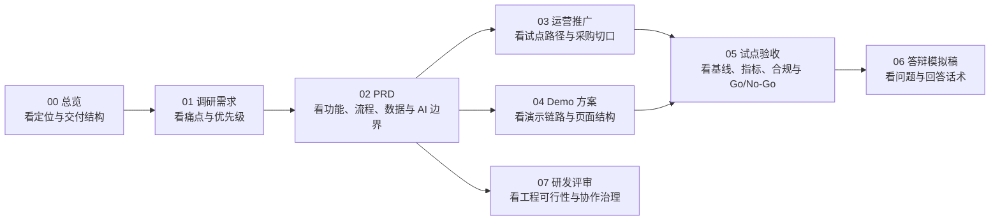
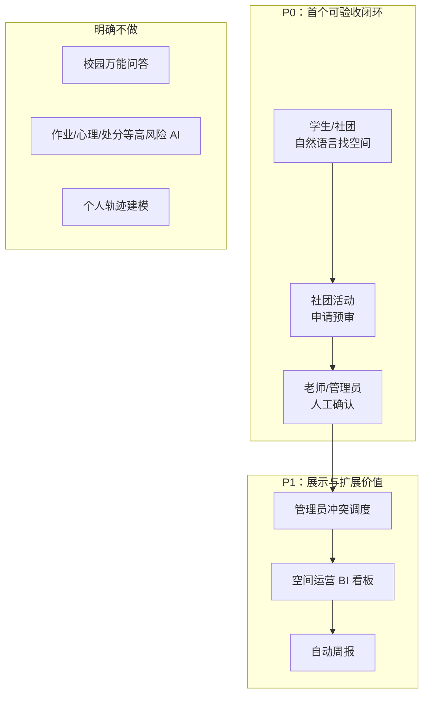
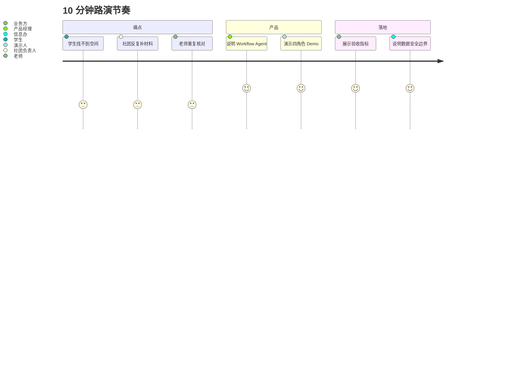

# CampusFlow 最终交付物总览

## 一句话定位

CampusFlow 是面向高校教务、学工和场地管理部门的校园空间预约与审批智能调度助手，帮助学校把“学生找空间、社团借场地、老师审申请、管理者看利用率”从人工查询和表格流转升级为可解释、可追踪、可验收的 AI 工作流。

## 项目名称

推荐正式名称：**CampusFlow 智校空间调度助手**

中文副标题：**面向高校教室、自习室和活动场地的 AI 预约审批与运营分析方案**

## 阅读地图

## 图示索引

| 文档 | 新增图示 | 用途 |
| --- | --- | --- |
| `00_最终交付物总览` | 阅读地图、MVP 范围图、路演节奏图 | 快速理解交付包结构和讲述路径 |
| `01_调研与需求分析` | 痛点归因图、角色心智图、用户旅程图、需求优先级图 | 帮评审理解为什么选这个场景 |
| `02_PRD` | 角色关系图、找空间时序图、申请预审时序图、数据 ER 图、规则过滤图、评分权重图 | 帮产品/研发/评审快速理解系统逻辑 |
| `03_运营推广方案` | 推广时间线、采购切口路径图、风险优先级图 | 帮运营/销售解释试点与扩展策略 |
| `04_Demo 方案与演示脚本` | 三栏页面布局图、四角色演示路径图、演示节奏时间线 | 帮演示人员快速组织路演 |
| `05_试点验收方案` | 试点主链路图、6 周甘特图、Go/No-Go 决策图 | 帮学校业务方和信息办判断能否试点 |
| `06_答辩模拟稿` | 开场话术、常见问题、加压追问、演示顺序 | 帮提交前进行答辩彩排 |
| `07_研发可行性与工程治理评审` | 前后端解耦图、Agent 调用链、仓库结构、模块边界图 | 帮研发评审判断能否落地 |

## 最终交付物结构

| 序号 | 文件 | 用途 | 主要读者 |
| --- | --- | --- | --- |
| 00 | `最终交付物总览` | 快速说明项目定位、边界、价值和路演顺序 | 评委、导师、项目负责人 |
| 01 | `调研与需求分析` | 证明需求真实、角色清晰、优先级合理 | 产品经理、业务方 |
| 02 | `PRD` | 定义功能、流程、数据、AI 边界和验收指标 | 产品、研发、数据、售前 |
| 03 | `运营推广方案` | 说明如何试点、推广、证明 ROI 和进入采购 | 运营、销售、学校管理方 |
| 04 | `Demo 方案与演示脚本` | 指导网页原型或 BI Demo 的制作与路演 | 设计、研发、演示人员 |
| 05 | `试点验收方案` | 明确试点范围、数据边界、基线采集和验收口径 | 学校业务方、信息办、采购评审 |
| 06 | `答辩模拟稿` | 预设评委问题并给出短答、展开答和加压追问 | 答辩人、路演演示人 |
| 07 | `研发可行性与工程治理评审` | 回答前后端解耦、Agent 接口、Git 协作、可维护性和异常边界 | 研发评委、技术负责人 |

## 方案收敛结论

原方案“校园空间与活动资源运营 Agent”方向成立，但覆盖了学生、社团、辅导员、教务、后勤、信息办和校领导的完整空间治理链路。作为最终交付物，本版本将首个 MVP 收敛为两条高频且可验收的闭环：

1. **自然语言找空间**：学生或社团负责人用一句话表达时间、人数、位置和设备需求，系统返回可用空间推荐及理由。
2. **社团活动申请预审**：社团负责人输入活动需求，系统自动匹配场地、生成申请单、识别风险项，并流转给人工审批。

BI 看板、周报、设备维修优先级和全校空间治理保留为 Demo 展示和二期能力，不作为 MVP 的首个验收核心。

## 为什么这个方向值得做

**场景高频**：找空教室、借活动场地、调整申请材料、核对课表和设备，是高校里反复发生的刚需。

**数据明确**：课表、空间基础信息、预约记录、设备状态、审批规则都能结构化表达，适合 Workflow Agent，而不是黑盒聊天机器人。

**角色闭环**：学生/社团产生需求，老师/管理员审核调度，信息办保障权限和数据，管理者看效率和利用率。

**ROI 可量化**：可以用找空间耗时、申请一次通过率、审批处理时长、冲突率、空间利用率等指标验收。

**贴合 ToB AI**：大模型负责理解和解释，关键动作由权限、规则、数据查询和人工复核控制，避免“AI 乱订教室”。

## 推荐路演讲述顺序

1. 用一个学生找教室和社团借场地的真实化故事切入。
2. 展示多角色痛点：学生找不到、社团反复改、老师重复核对、管理者看不到数据。
3. 说明产品不是校园版 ChatGPT，而是 AI 调度工作流。
4. 演示三条链路：找空间、申请预审、管理员看板。
5. 讲清楚 MVP 边界：先做两条闭环，后续扩展到空间运营。
6. 用指标说明价值：节省时间、降低冲突、提升利用率。
7. 说明试点验收：从学工/团委的社团场地审批切入，用基线对比、数据安全和人工审批边界证明可落地。

## 外部依据

- 教育部 2025 年国家教育数字化战略行动部署将“人工智能与教育变革”作为重要主题，强调推动教育数字化转型。
- 教育部《“人工智能+教育”行动计划》相关解读提出围绕学校治理、资源配置、科学决策等方向布局应用场景。
- 《教育数据安全分类分级指南》为高校数据治理、安全分级和权限控制提供了政策依据。
- FineBI / FineChatBI 官方能力覆盖自然语言问数、多轮追问、结果校验、数据解读、归因分析和趋势预测，适合作为 Demo 的数据分析底座。

## 最终判断

CampusFlow 的价值不在于“AI 看起来很酷”，而在于把校园空间资源这类低效、分散、靠人工经验协调的工作，变成有数据依据、有规则边界、有审批闭环、有指标验收的管理工具。当前交付物已经覆盖方案、PRD、运营、Demo、试点验收、答辩模拟和研发工程治理评审，适合作为训练营或路演项目，也具备继续打磨成高校行业解决方案模板的潜力。
