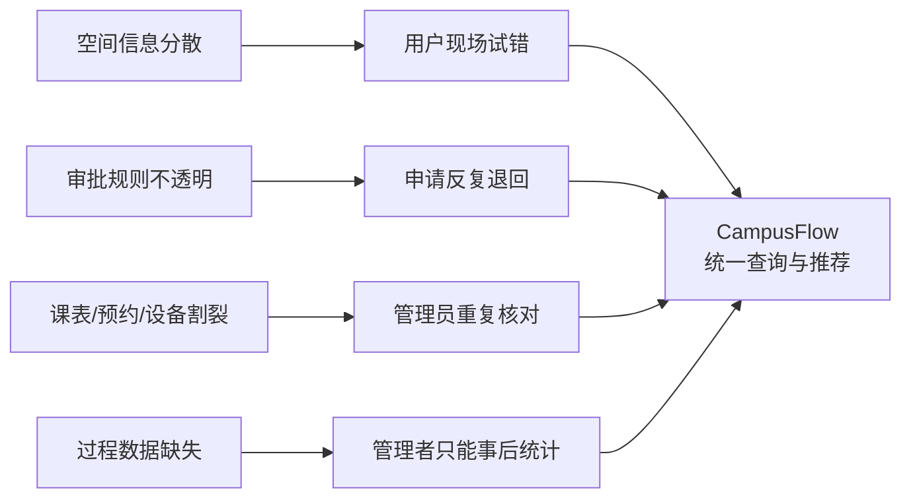
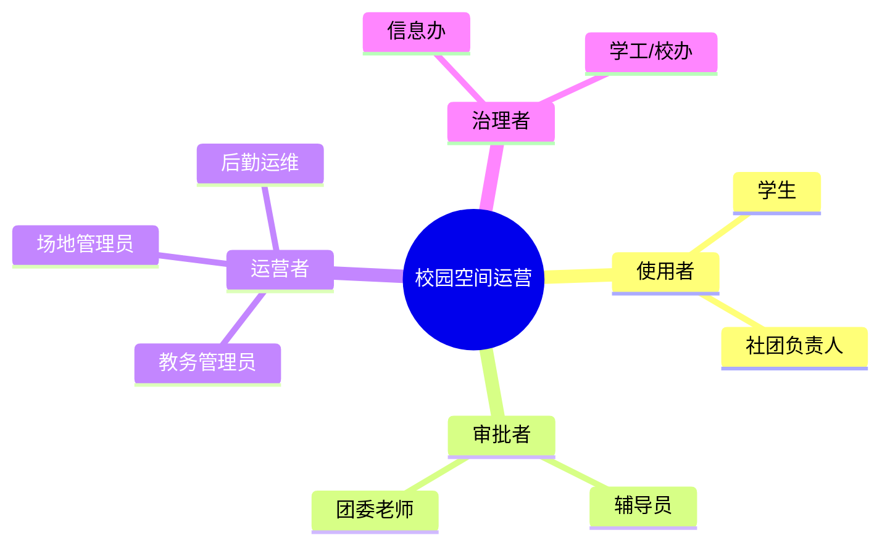
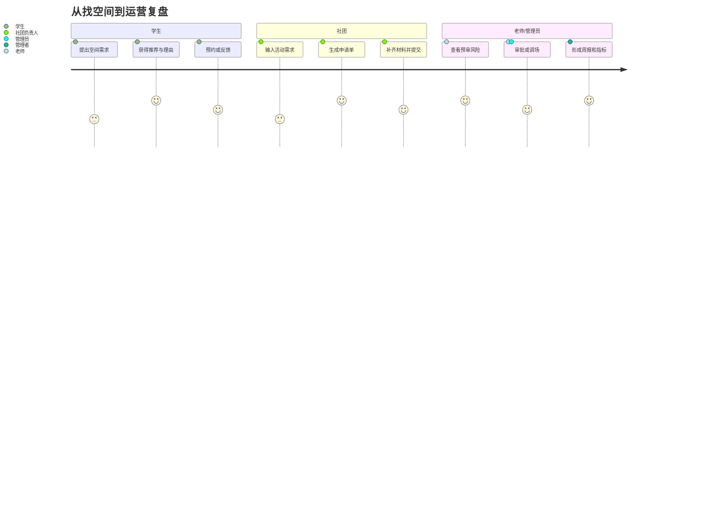
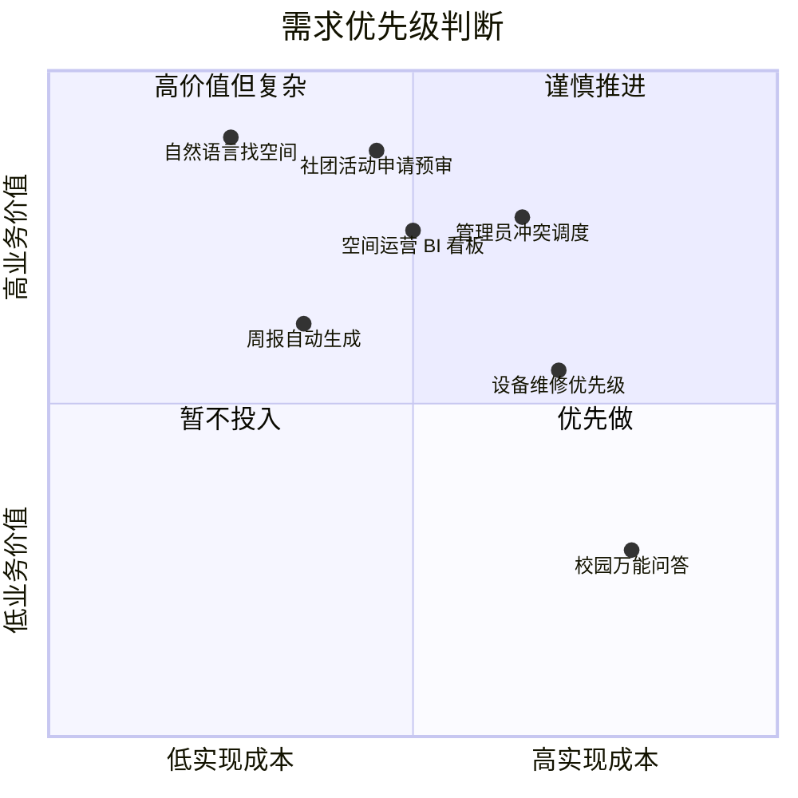

# 调研与需求分析

## 一、背景与问题定义

高校空间资源包括普通教室、阶梯教室、研讨室、自习区、报告厅、学生活动中心和临时开放空间。它们看似是“有没有空房间”的问题，实际牵涉课表、预约、设备、门禁、审批、活动安全、开放时间和管理统计。

当前校园空间使用常见问题有四类：

1. **学生找空间靠经验**：空教室信息分散，学生通常依赖微信群、同学经验或现场寻找。
2. **社团借场地反复沟通**：活动人数、设备、时间、外校人员、审批材料都要人工确认。
3. **老师和管理员重复核对**：审批人需要逐项查看课表、场地容量、设备状态、风险规则。
4. **管理者缺少运营视角**：空间拥堵、空置、审批瓶颈和设备故障影响往往只能事后统计。

CampusFlow 的核心需求不是“做一个能聊天的校园 AI”，而是把空间查询、场地申请、审批预审和运营分析变成可控的 AI 工作流。

## 二、调研目标

本次调研目标分为三层：

| 层级 | 要验证的问题 | 判断标准 |
| --- | --- | --- |
| 用户层 | 学生和社团是否真的愿意用自然语言找空间、借场地 | 是否高频、是否比现有方式省时 |
| 业务层 | 老师和管理员是否认可 AI 预审 | 是否能减少重复核对、降低冲突 |
| 管理层 | 学校是否愿意为运营数据和效率提升投入 | 是否能形成可量化 ROI 和试点场景 |

## 三、调研对象与访谈记录

以下为基于高校真实业务角色构造的调研样本，用于产品方案论证和 Demo 剧本设计。

| 调研对象 | 角色 | 当前做法 | 核心痛点 | 典型原话 | 抽象需求 |
| --- | --- | --- | --- | --- | --- |
| 张同学 | 大三学生，考研党 | 靠微信群、经验和现场寻找空教室 | 空教室信息不实时，去了才发现有课、关门或太吵 | “我不是想聊天，我就想知道现在去哪儿坐得下。” | 实时空间查询、距离/安静度/插座筛选 |
| 李同学 | 社团负责人 | 填表后找辅导员、场地老师反复确认 | 不知道哪个场地能用，申请材料常被打回 | “最麻烦的是不知道哪个能用，老师也要反复确认。” | 自然语言申请、自动匹配场地、材料清单 |
| 王老师 | 学院辅导员 | 手工审核活动申请和安全材料 | 人数、外校人员、设备、安全风险要逐项检查 | “我需要系统先帮我判断风险，而不是把一堆表扔给我。” | AI 预审、风险提示、人工确认 |
| 陈老师 | 教务处教室管理员 | 对照课表、活动申请和考试安排协调 | 冲突多，调课和活动规则复杂 | “不是没有教室，是没人知道怎么高效调。” | 规则过滤、可替代空间推荐 |
| 赵师傅 | 后勤运维人员 | 根据报修单被动维修 | 不知道哪些故障影响最大、优先级最高 | “有些投影坏了没人报，有些坏一次影响很多活动。” | 设备影响分析、维修优先级 |
| 刘主任 | 信息办/数据中心 | 管理系统接口、数据权限和审计 | 担心数据越权、AI 幻觉和不可追责 | “AI 可以用，但不能乱查学生数据，也不能乱订教室。” | 权限控制、审计日志、数据溯源 |
| 孙处长 | 学工/校办管理者 | 看月度汇总报表或临时报数 | 看不到实时拥堵、资源浪费和审批瓶颈 | “我想知道开放哪些空间最能缓解学生抱怨。” | BI 看板、周报、预测建议 |

## 四、角色分层

| 角色类型 | 代表角色 | 关注点 | 产品设计启示 |
| --- | --- | --- | --- |
| 高频使用者 | 学生、社团负责人 | 快、准、少填表 | 入口要轻，结果要可直接行动 |
| 业务审批者 | 辅导员、场地管理员 | 风险、合规、材料完整 | AI 只做预审和建议，最终审批保留人工 |
| 运营维护者 | 教务、后勤 | 冲突、设备、调度效率 | 需要可解释推荐和异常提醒 |
| 数据与安全方 | 信息办 | 权限、审计、数据分级 | 必须有角色权限、日志和数据来源 |
| 决策者 | 学工处、教务处、校办 | 投入产出、服务满意度 | 必须用指标证明试点价值 |

## 五、用户旅程

### 旅程 1：学生找空间

| 阶段 | 当前体验 | 问题 | CampusFlow 目标体验 |
| --- | --- | --- | --- |
| 产生需求 | 想找晚间自习或小组讨论空间 | 不知道哪里空 | 输入一句自然语言描述需求 |
| 查询空间 | 问群、查表、凭经验 | 信息不实时，条件不完整 | 系统解析时间、人数、设备、位置偏好 |
| 到达现场 | 可能被占用、没开门、太吵 | 试错成本高 | 返回 3 个推荐空间及可信理由 |
| 后续反馈 | 很少反馈 | 系统无法学习偏好 | 点赞/点踩推荐，积累满意度 |

### 旅程 2：社团申请活动场地

| 阶段 | 当前体验 | 问题 | CampusFlow 目标体验 |
| --- | --- | --- | --- |
| 提出活动需求 | 社团负责人先写活动方案 | 不知道哪些场地符合条件 | 输入时间、人数、设备和嘉宾需求 |
| 选择场地 | 询问老师或查表 | 容量、设备、开放时间不透明 | 系统推荐主场地和备选场地 |
| 填申请表 | 多个系统或表格重复填写 | 材料容易缺漏 | 自动生成申请单和材料清单 |
| 审批流转 | 老师逐项核对 | 打回次数多，处理慢 | AI 预审风险，人工确认后流转 |
| 复盘统计 | 很少沉淀数据 | 不知道哪里卡住 | 统计通过率、处理时长、冲突原因 |

### 旅程 3：管理员调度与管理

| 阶段 | 当前体验 | 问题 | CampusFlow 目标体验 |
| --- | --- | --- | --- |
| 查看申请 | 多个表格或系统分散 | 缺少统一视图 | 工作台集中显示待处理申请 |
| 判断冲突 | 人工查课表、预约和设备 | 容易漏看规则 | 系统自动标记冲突和风险 |
| 给出调整 | 靠经验推荐替代空间 | 推荐依据难说明 | 推荐可替代空间并显示理由 |
| 汇报情况 | 月底人工统计 | 滞后且费时 | 自动生成看板和周报摘要 |

## 六、痛点归因

| 痛点 | 表层表现 | 深层原因 | 产品机会 |
| --- | --- | --- | --- |
| 找空间难 | 学生现场试错 | 空间可用状态没有统一入口 | 自然语言查询 + 空间推荐 |
| 借场地慢 | 申请被反复打回 | 规则、设备、容量和材料要求不透明 | 申请预审 + 材料清单 |
| 管理员累 | 人工核对信息 | 数据分散、规则靠经验 | 数据聚合 + 规则引擎 |
| 冲突频繁 | 热门时段抢场地 | 缺少替代推荐和需求预测 | 推荐排序 + 冲突分析 |
| 领导看不清 | 只能看月报 | 缺少过程数据和实时指标 | BI 看板 + 周报 |
| 信息办担忧 | AI 越权或乱答 | 权限边界和数据来源不清 | RBAC + 审计 + 溯源 |

## 七、需求优先级模型

采用“业务价值 / 实现成本”的方式排序，综合考虑广度、频度、节省时间、风险和可演示性。

评分说明：

- 广度：影响用户范围，1-5 分。
- 频度：发生频率，1-5 分。
- 节省时间：单次可节省时间，1-5 分。
- 管理价值：对学校管理和 ROI 的价值，1-5 分。
- 实现成本：数据、流程和系统集成复杂度，1-5 分，分数越高成本越高。
- 优先级分 = `(广度 + 频度 + 节省时间 + 管理价值) / 实现成本`。

| 需求 | 广度 | 频度 | 节省时间 | 管理价值 | 成本 | 优先级分 | 结论 |
| --- | --- | --- | --- | --- | --- | --- | --- |
| 自然语言找空间 | 5 | 5 | 4 | 3 | 2 | 8.5 | P0 |
| 社团活动申请预审 | 4 | 4 | 5 | 5 | 3 | 6.0 | P0 |
| 管理员冲突调度 | 3 | 4 | 5 | 5 | 4 | 4.25 | P1 |
| 空间运营 BI 看板 | 3 | 3 | 3 | 5 | 3 | 4.67 | P1 |
| 周报自动生成 | 2 | 2 | 4 | 4 | 2 | 6.0 | P1，适合 Demo 展示 |
| 设备维修优先级 | 2 | 2 | 3 | 4 | 4 | 2.75 | P2 |
| 全校空间预测调度 | 3 | 2 | 4 | 5 | 5 | 2.8 | P2 |
| 校园万能问答 | 5 | 5 | 2 | 1 | 5 | 2.6 | 不做 |

## 八、MVP 边界

### P0 必做

1. 学生/社团自然语言找空间。
2. 社团活动场地申请预审。
3. 空间可用性、容量、设备、开放时间和预约冲突过滤。
4. 申请单自动生成。
5. 风险项识别和人工审批流转。
6. 结果可解释：说明为什么推荐、为什么不可用、缺少什么材料。
7. 基础指标统计：推荐采纳率、申请一次通过率、平均审批时长、冲突率。

### P1 可展示

1. 管理员冲突工作台。
2. 空间利用率和冲突排行看板。
3. 周报自动生成。
4. 常见问数：本周冲突最多的空间、哪些设备影响活动最多。

### 暂不做

1. 作业代写、课程问答、心理咨询等边界高风险场景。
2. 直接接管审批人的最终决策。
3. 实时调度全校所有门禁和座位数据。
4. 复杂机器学习预测模型。
5. 面向所有校园生活服务的通用 Agent。

## 九、数据可获得性评估

| 数据 | 是否必须 | Demo 阶段 | 试点阶段 | 风险 |
| --- | --- | --- | --- | --- |
| 空间基础信息 | 必须 | Mock 表 | Excel/CSV 导入 | 低 |
| 课程课表 | 必须 | Mock 表 | 教务导出或 API | 中 |
| 场地预约记录 | 必须 | Mock 表 | OA/预约系统导出 | 中 |
| 审批规则 | 必须 | 手工整理 | 学工/教务确认规则表 | 低 |
| 设备状态 | 可选 | Mock 表 | 后勤报修系统导出 | 中 |
| 门禁/座位占用 | 可选 | 生成模拟数据 | 仅取聚合数据 | 高 |
| 用户身份与角色 | 必须 | Mock 用户 | 统一身份认证或角色表 | 中 |
| 满意度反馈 | 可选 | Demo 点击 | 系统内点赞/点踩 | 低 |

MVP 不依赖个人轨迹、精确门禁记录或敏感学生画像。涉及占用情况时，优先使用空间级聚合数据，避免处理个人敏感信息。

## 十、采购与采用假设

学生和社团是高频使用者，但不是采购方。首个采购切口建议放在 **学工处/团委的社团场地审批效率提升**，理由是：

1. 社团活动申请痛点具体，容易讲清楚。
2. 审批链路短于全校教务系统改造。
3. 可以用一次通过率、审批时长和打回次数证明价值。
4. 后续可以自然扩展到教务处空间治理和校级 BI 看板。

备选采购切口是 **教务处教室利用率治理**，适合空间资源紧张、晚间自习需求强的学校。

## 十一、调研结论

CampusFlow 的核心机会是用 AI 降低校园空间资源的协调成本。最适合的首版不是“全校空间运营大脑”，而是一个轻量但闭环完整的空间预约与审批智能助手。

产品成功的关键不是模型能力本身，而是四件事：

1. 数据能不能稳定拿到。
2. 推荐理由能不能让老师信任。
3. 审批风险能不能被清楚标记。
4. 试点指标能不能证明节省时间和降低冲突。
