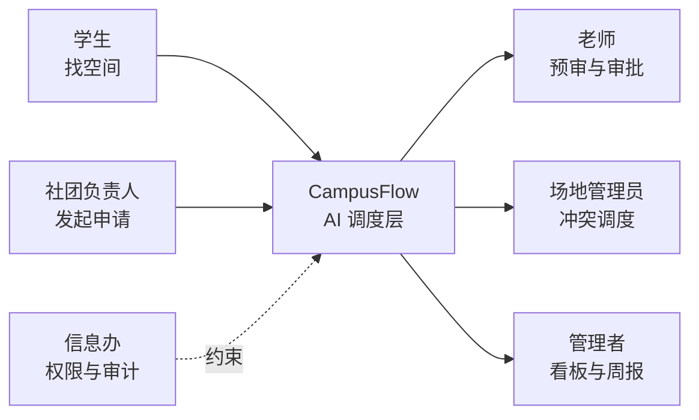
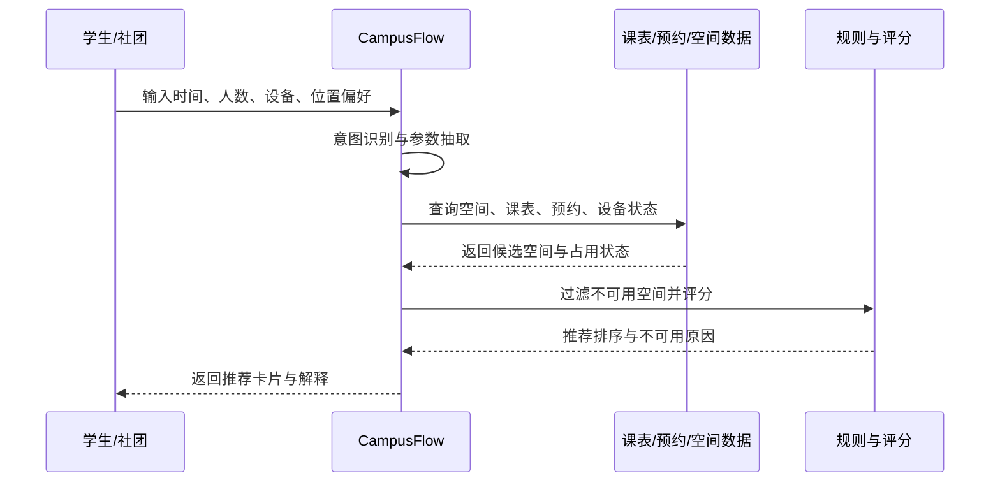
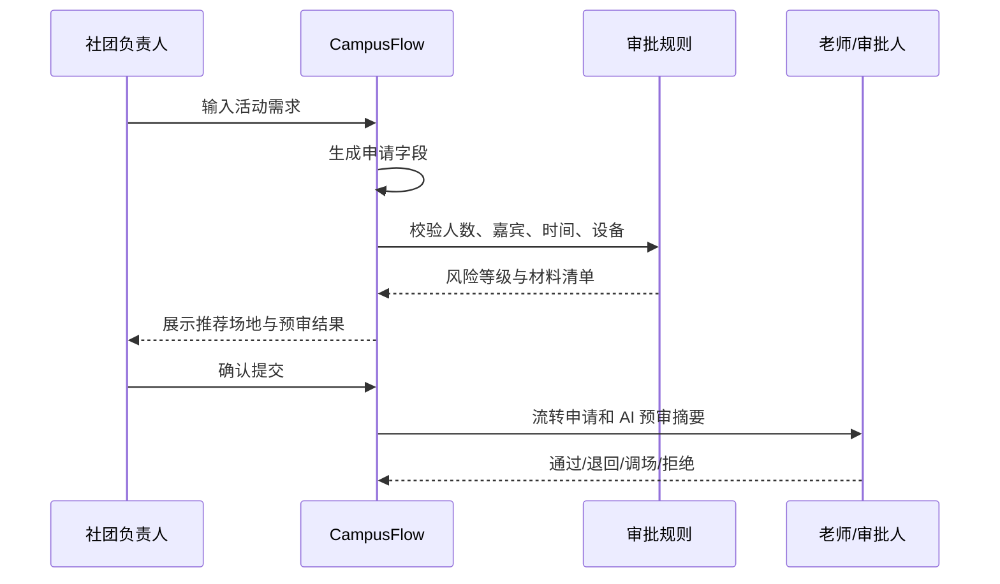
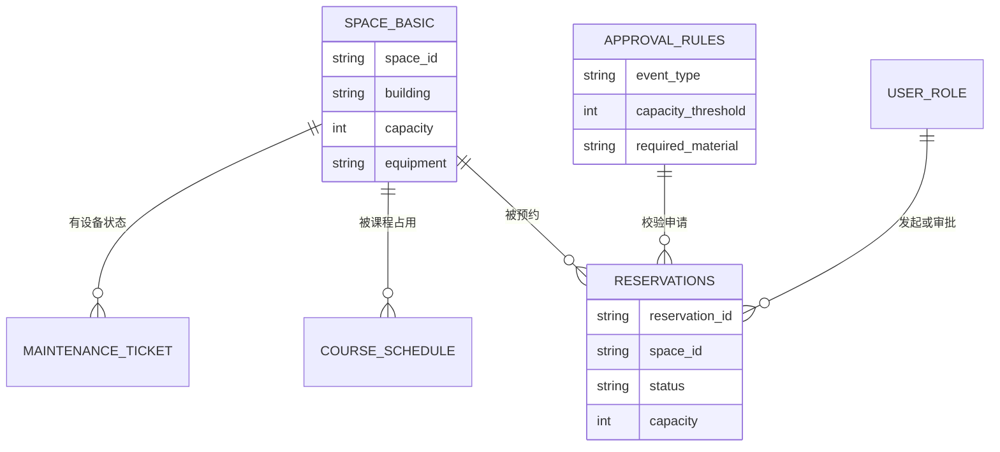
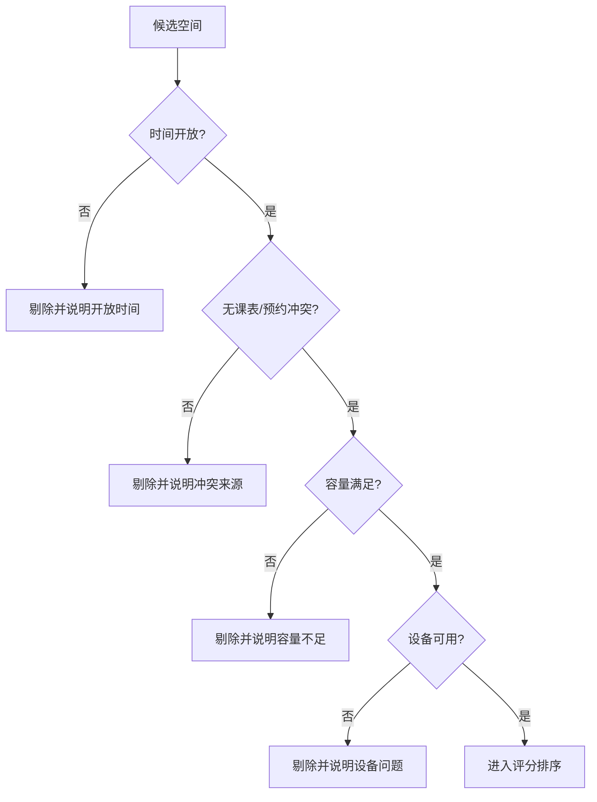
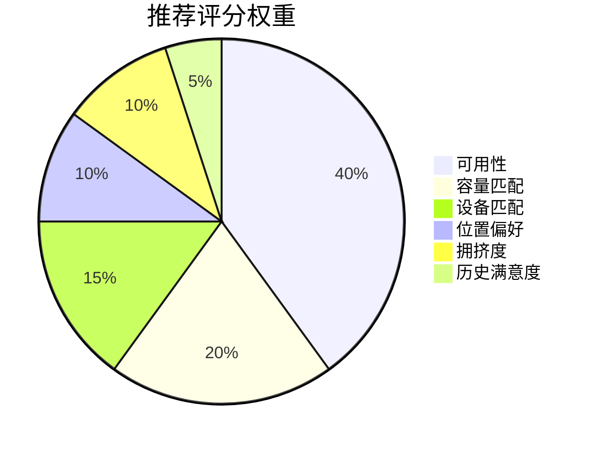

# PRD：校园空间预约与审批智能调度助手

## 一、产品概述

### 1.1 产品名称

CampusFlow 智校空间调度助手

### 1.2 产品定位

CampusFlow 是面向高校教务、学工、团委和场地管理部门的 AI 工作流产品。它通过自然语言理解、结构化数据查询、规则过滤、推荐排序和人工审批流转，帮助学生和社团快速找到合适空间，帮助老师和管理员减少重复核对，帮助管理者掌握空间利用和审批效率。

### 1.3 产品目标

首版目标是在一个学院、一个校区片区或一组楼宇内跑通两条闭环：

1. 学生/社团自然语言找空间。
2. 社团活动场地申请预审与人工审批流转。

产品不是通用聊天机器人，也不替代学校既有教务、OA 或预约系统。它定位为现有系统之上的 AI 调度层和流程助手。

## 二、目标用户与权限

| 用户角色 | 典型用户 | 核心权限 | 关键诉求 |
| --- | --- | --- | --- |
| 学生 | 普通学生、考研学生、小组成员 | 查询可公开空间、提交普通预约 | 快速找到可用空间 |
| 社团负责人 | 社长、活动负责人 | 查询活动场地、发起活动申请、查看审批状态 | 快速匹配场地，减少材料打回 |
| 辅导员/审批老师 | 学院辅导员、团委老师 | 查看待审申请、查看 AI 预审、审批或退回 | 降低重复核对，控制风险 |
| 场地管理员 | 教务/场馆管理员 | 管理空间可用性、处理冲突、调整场地 | 提高调度效率 |
| 后勤人员 | 设备和维修人员 | 查看设备故障和影响范围 | 优先处理高影响故障 |
| 信息办管理员 | 数据中心、系统管理员 | 配置数据源、权限、日志和审计 | 防止越权和不可追责 |
| 管理者 | 学工处、教务处、校办 | 查看汇总看板和周报 | 评估资源利用和服务质量 |



## 三、MVP 范围

### 3.1 P0 功能

| 模块 | 功能 | 描述 |
| --- | --- | --- |
| 自然语言找空间 | 意图识别 | 判断用户是找自习空间、讨论空间还是活动场地 |
| 自然语言找空间 | 参数抽取 | 抽取时间、人数、位置、设备、空间类型、安静度等条件 |
| 自然语言找空间 | 推荐空间 | 根据可用性、容量、设备、距离和拥挤度返回推荐 |
| 自然语言找空间 | 推荐解释 | 展示推荐理由、数据来源和不可用原因 |
| 活动申请预审 | 申请单生成 | 根据自然语言自动生成活动申请字段 |
| 活动申请预审 | 规则校验 | 校验人数、时段、外校人员、设备、安全材料 |
| 活动申请预审 | 风险提示 | 输出风险等级、补充材料和审批人 |
| 活动申请预审 | 人工流转 | AI 不直接通过高风险申请，只提交给审批人确认 |
| 指标统计 | 基础运营指标 | 统计推荐采纳率、申请一次通过率、审批时长、冲突率 |

### 3.2 P1 功能

| 模块 | 功能 | 描述 |
| --- | --- | --- |
| 管理员工作台 | 冲突列表 | 显示同一时间段、同一空间或设备不可用导致的冲突 |
| 管理员工作台 | 替代空间推荐 | 给出容量、设备和距离相近的替代空间 |
| BI 看板 | 空间利用率 | 展示楼宇、空间类型和时段维度的利用率 |
| BI 看板 | 审批效率 | 展示平均处理时长、退回原因和审批瓶颈 |
| 周报生成 | 自动摘要 | 生成本周空间运营摘要和下周建议 |

### 3.3 非目标

1. 不做校园全能问答。
2. 不处理作业、心理咨询、处分建议等高风险内容。
3. 不让 AI 绕过审批人直接批准高风险申请。
4. 不在 MVP 中依赖个人级门禁轨迹或敏感画像。
5. 不替换学校原有 OA、教务或统一身份认证系统。

## 四、核心流程

### 4.1 自然语言找空间流程



1. 用户输入：“今晚 7 点后，找一个离东门近、适合 4 人讨论、有插座的地方。”
2. 系统识别意图为 `space_search`。
3. 系统抽取参数：
   - 时间：今日 19:00 后
   - 人数：4 人
   - 空间类型：讨论/自习
   - 设备：插座
   - 位置偏好：东门附近
4. 权限校验：用户是否有查询对应空间的权限。
5. 数据查询：查询空间基础表、课表、预约记录、开放时间和设备状态。
6. 规则过滤：排除已占用、未开放、容量不足、设备不可用空间。
7. 推荐排序：按评分返回 3-5 个候选空间。
8. 结果解释：展示可用时间、容量、设备、距离、拥挤度和推荐理由。
9. 用户操作：预约、收藏、重新筛选或点踩反馈。

### 4.2 社团活动申请预审流程



1. 社团负责人输入：“周五 19:00 办 80 人 AI 分享会，需要投影和麦克风，可能有 5 个外校嘉宾。”
2. 系统识别意图为 `event_application`。
3. 系统抽取活动字段：
   - 活动类型：讲座/分享会
   - 时间：周五 19:00
   - 人数：80
   - 设备：投影、麦克风
   - 外校嘉宾：是
4. 系统匹配可用场地并生成备选方案。
5. 系统执行审批规则：
   - 人数超过 50 人，需要辅导员审批。
   - 存在外校嘉宾，需要上传人员名单。
   - 活动超过 21:30，需要确认安保或延时开放。
6. 系统生成申请单和材料清单。
7. 用户确认后提交给审批老师。
8. 审批老师看到 AI 预审结果、风险项、推荐理由和原始数据来源。
9. 审批老师选择通过、退回补充、调整场地或拒绝。

### 4.3 管理员冲突处理流程

1. 管理员打开工作台查看冲突申请。
2. 系统标记冲突类型：课表冲突、预约冲突、容量不足、设备不可用、开放时间冲突。
3. 系统推荐替代空间，并说明容量、设备、距离和可用时间。
4. 管理员选择调换、退回或人工指定空间。
5. 系统记录处理结果，用于后续推荐优化。

## 五、AI 工作流设计

CampusFlow 采用 Workflow Agent，不采用黑盒自主 Agent。


### 5.1 大模型负责

1. 识别用户意图。
2. 从自然语言中抽取结构化参数。
3. 在缺少关键信息时追问。
4. 将规则、数据和推荐结果转写成用户可读解释。
5. 生成周报摘要草稿。

### 5.2 确定性系统负责

1. 权限校验。
2. 数据库查询。
3. 规则过滤。
4. 推荐评分。
5. 预约写入。
6. 审批流转。
7. 审计日志。

### 5.3 RAG 知识库范围

RAG 只放规则和说明类内容：

1. 场地申请制度。
2. 活动审批规则。
3. 外校人员入校要求。
4. 设备使用说明。
5. 开放时间规则。
6. 常见问题说明。

结构化数据不让模型凭空生成，必须通过数据库、BI 或 Mock 数据查询获得。

## 六、结构化输出协议

### 6.1 找空间输出

```json
{
  "intent": "space_search",
  "time_range": {
    "date": "2026-06-05",
    "start": "19:00",
    "end": "22:00"
  },
  "capacity": 4,
  "space_type": "discussion",
  "equipment": ["power_socket"],
  "location_preference": "east_gate",
  "quiet_preference": "quiet"
}
```

### 6.2 活动申请输出

```json
{
  "intent": "event_application",
  "event_name": "AI 分享会",
  "event_type": "lecture",
  "time_range": {
    "date": "2026-06-05",
    "start": "19:00",
    "end": "21:30"
  },
  "capacity": 80,
  "equipment": ["projector", "microphone"],
  "external_guests": true,
  "external_guest_count": 5,
  "risk_level": "medium"
}
```

### 6.3 推荐结果输出

```json
{
  "space_id": "B203",
  "space_name": "教学楼 B203",
  "available_time": "19:00-22:00",
  "capacity": 12,
  "matched_equipment": ["power_socket", "whiteboard"],
  "score": 88,
  "reasons": [
    "当前时段无课程和预约冲突",
    "容量满足 4 人讨论",
    "距离东门约 180 米",
    "预计占用率 35%"
  ],
  "data_sources": ["space_basic", "course_schedule", "reservations", "occupancy_log"]
}
```

## 七、数据模型

### 7.1 Demo 数据表



| 表名 | 关键字段 | 用途 |
| --- | --- | --- |
| `space_basic` | `space_id`, `building`, `room_name`, `capacity`, `type`, `equipment`, `open_hours`, `location_tag` | 空间基础信息 |
| `course_schedule` | `space_id`, `date`, `start_time`, `end_time`, `course_name`, `schedule_type` | 判断教学占用 |
| `reservations` | `reservation_id`, `space_id`, `applicant_id`, `event_type`, `status`, `capacity`, `start_time`, `end_time` | 判断预约占用和审批状态 |
| `occupancy_log` | `space_id`, `time_slot`, `occupancy_rate` | 展示或预测拥挤度 |
| `maintenance_ticket` | `ticket_id`, `space_id`, `equipment`, `status`, `impact_level` | 过滤设备不可用空间 |
| `approval_rules` | `rule_id`, `event_type`, `capacity_threshold`, `risk_condition`, `required_material`, `approver_role` | 自动预审 |
| `user_role` | `user_id`, `role`, `department`, `permission_scope` | 权限控制 |
| `feedback_log` | `feedback_id`, `user_id`, `space_id`, `action`, `rating`, `created_at` | 推荐优化和满意度统计 |

### 7.2 数据接入策略

| 阶段 | 数据方式 | 目标 |
| --- | --- | --- |
| Demo | JSON/CSV Mock 数据 | 快速演示完整闭环 |
| 试点 | Excel/CSV 定期导入 | 降低初期系统集成成本 |
| 扩展 | API 或数据库视图 | 提升实时性和自动化 |
| 正式版 | 数据中台/BI 平台接入 | 支持跨部门治理和审计 |

## 八、推荐与规则逻辑

### 8.1 可用性硬规则



空间必须同时满足：

1. 目标时间段无课程占用。
2. 目标时间段无已通过预约。
3. 空间开放时间覆盖目标时段。
4. 容量不小于申请人数。
5. 必需设备处于可用状态。
6. 用户角色拥有查询或申请权限。

不满足硬规则的空间不进入推荐列表，但可以展示不可用原因。

### 8.2 推荐评分

推荐分数采用规则评分，首版不引入复杂机器学习。



| 因子 | 权重 | 说明 |
| --- | --- | --- |
| 可用性 | 40% | 时间段是否完整可用，是否存在临近冲突 |
| 容量匹配 | 20% | 容量既要满足人数，也避免过度占用大空间 |
| 设备匹配 | 15% | 必需设备和加分设备的匹配程度 |
| 位置偏好 | 10% | 与用户偏好位置或原申请地点的距离 |
| 拥挤度 | 10% | 当前或预测占用率越低越好 |
| 历史满意度 | 5% | 用户反馈和历史采纳情况 |

### 8.3 风险等级

| 风险等级 | 条件示例 | 处理方式 |
| --- | --- | --- |
| 低 | 30 人以内、无外校人员、普通教室、正常开放时间 | 自动生成申请单，提交常规审批 |
| 中 | 50 人以上、有外校人员、需要特殊设备 | 补充材料后提交辅导员或团委审批 |
| 高 | 大型活动、晚间延时、涉及校外公众、安全保障要求高 | 必须人工复核，不允许自动通过 |

## 九、异常与兜底

| 异常场景 | 系统处理 |
| --- | --- |
| 缺少人数 | 追问“预计多少人参加？” |
| 缺少时间 | 追问“希望使用哪一天、几点到几点？” |
| 没有完全匹配空间 | 返回最接近的替代方案，并说明差异 |
| 课表和维修数据冲突 | 同时展示冲突来源，默认按不可用处理 |
| 置信度低 | 只给建议，不提交申请 |
| 用户越权查询 | 拒绝展示敏感空间或非授权数据 |
| 高风险活动 | 强制人工审批 |
| 数据源不可用 | 提示当前数据更新时间，并降级到人工联系入口 |

## 十、指标体系

### 10.1 MVP 验收指标

| 指标 | 目标值 | 说明 |
| --- | --- | --- |
| 场地推荐人工抽检通过率 | ≥ 90% | 老师或管理员抽查推荐是否合理 |
| 申请单字段完整率 | ≥ 85% | AI 生成申请单关键字段完整 |
| 风险识别命中率 | ≥ 80% | 对人数、外校人员、晚间活动等风险识别准确 |
| 社团申请一次通过率 | 提升 30% | 相比试点前减少退回 |
| 管理员人工核对时间 | 降低 40% | 用样本任务计时 |
| 推荐采纳率 | ≥ 60% | 用户点击预约或提交申请的比例 |
| 用户点踩率 | ≤ 10% | 推荐不满意反馈比例 |

### 10.2 运营指标

| 指标 | 目的 |
| --- | --- |
| 找空间平均耗时 | 衡量学生体验 |
| 预约冲突率 | 衡量调度质量 |
| 平均审批处理时长 | 衡量审批效率 |
| 申请退回原因 TOP5 | 定位规则和材料问题 |
| 热门时段利用率 | 判断空间供需 |
| 空置空间 TOP5 | 发现资源浪费 |
| 设备故障影响次数 | 指导后勤维修 |

## 十一、安全与合规

1. 用户只能看到与角色权限匹配的数据。
2. 学生端不展示其他个人的预约隐私，只展示空间是否可用。
3. 占用率优先使用空间级聚合数据，不展示个人轨迹。
4. 所有推荐、申请、审批和数据查询写入审计日志。
5. AI 输出必须展示数据来源和更新时间。
6. 对高风险活动保留人工审批，不做自动通过。
7. 按教育数据安全分类分级原则处理数据，敏感数据最小化使用。

## 十二、页面结构

### 12.1 学生/社团端

1. 自然语言输入区。
2. 条件解析结果。
3. 推荐空间卡片。
4. 预约或申请按钮。
5. 申请单预览。
6. 审批状态。
7. 反馈入口。

### 12.2 审批老师端

1. 待审批列表。
2. AI 预审摘要。
3. 风险项和材料清单。
4. 推荐场地和备选场地。
5. 审批操作：通过、退回、调整、拒绝。
6. 审批记录。

### 12.3 管理员端

1. 冲突申请列表。
2. 替代空间推荐。
3. 空间利用率看板。
4. 审批效率看板。
5. 周报生成入口。

## 十三、产品路线图

| 阶段 | 时间 | 目标 | 能力 |
| --- | --- | --- | --- |
| Demo | 1-2 周 | 跑通演示闭环 | Mock 数据、自然语言解析、推荐卡片、申请单、看板 |
| MVP 试点 | 4-6 周 | 小范围真实验证 | CSV 导入、角色权限、人工审批、指标统计 |
| PMF 扩展 | 2-3 个月 | 扩展空间和角色 | API 接入、管理员工作台、周报、反馈优化 |
| 行业模板 | 3-6 个月 | 产品化复制 | 高校空间数据模型、审批模板、售前 Demo 包 |

## 十四、成功标准

CampusFlow 首版成功的判断标准不是模型回答多自然，而是能否证明：

1. 用户更快找到可用空间。
2. 社团申请被打回次数减少。
3. 老师和管理员少做重复核对。
4. 学校能看到空间资源运营数据。
5. AI 行为可解释、可审计、可人工接管。
