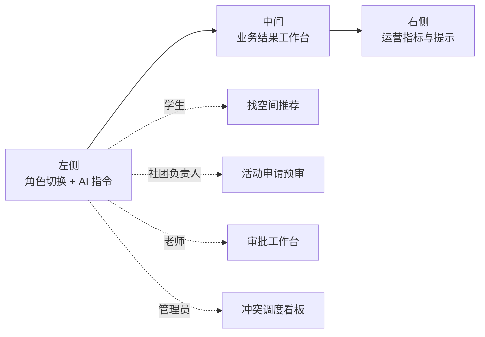
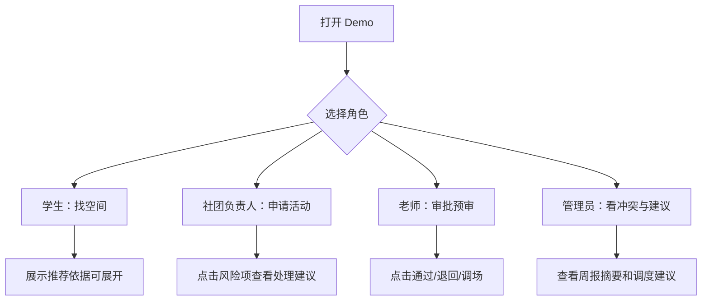
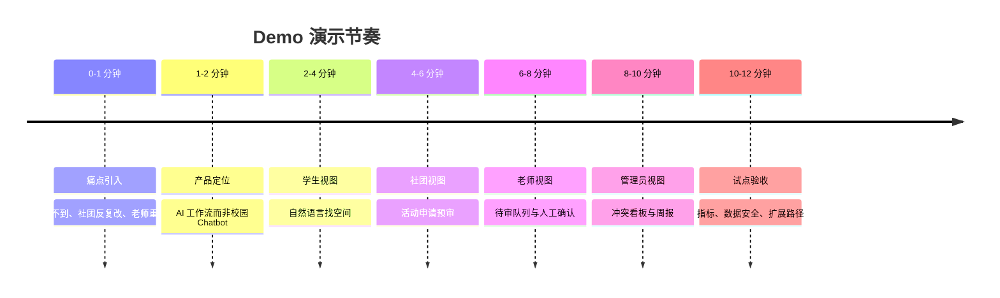

# Demo 方案与演示脚本

## 一、Demo 目标

Demo 的目标不是展示一个“会聊天”的 AI，而是展示 CampusFlow 如何把校园空间查询、社团场地申请、审批预审和运营分析串成一个可解释的业务闭环。

Demo 要让评委或业务方在 8-12 分钟内看懂三件事：

1. 学生和社团为什么愿意用。
2. 老师和管理员为什么愿意信。
3. 学校管理者为什么愿意继续试点。

## 二、Demo 范围

### 必须演示

1. 自然语言找空间。
2. 社团活动申请预审。
3. 管理员运营看板和周报摘要。

### 不必真实接入

1. 不接真实教务系统。
2. 不接真实门禁系统。
3. 不接真实统一身份认证。
4. 不调用真实审批 OA。

Demo 阶段使用 Mock 数据即可，但页面要体现真实数据字段、权限边界和审核逻辑。

## 三、信息架构

建议做一个单页 Web Demo，分成三栏：



| 区域 | 位置 | 内容 | 作用 |
| --- | --- | --- | --- |
| AI 输入区 | 左侧 | 自然语言输入框、示例问题、角色切换 | 展示低门槛入口 |
| 业务结果区 | 中间 | 推荐空间卡片、申请单、风险预审 | 展示核心业务闭环 |
| 数据看板区 | 右侧 | 利用率、冲突排行、审批效率、周报 | 展示管理价值 |

如果使用演示幻灯片而不是网页，也建议按这个结构组织每页内容。



## 四、页面设计建议

### 4.1 顶部导航

内容：

1. 产品名称：CampusFlow 智校空间调度助手。
2. 当前角色：学生、社团负责人、审批老师、管理员。
3. 当前试点范围：东区教学楼、图书馆研讨室、学生活动中心。
4. 数据更新时间：例如 2026-05-31 18:00。

设计重点：

- 明确这是一个业务系统，不是营销页。
- 不需要大幅宣传文案。
- 数据更新时间必须可见，体现可信度。

### 4.2 左侧 AI 输入区

内容：

1. 自然语言输入框。
2. 三个示例按钮：
   - 今晚 7 点后找 4 人讨论空间，要插座，离东门近。
   - 周五 19:00 办 80 人 AI 分享会，需要投影和麦克风。
   - 本周哪些空间冲突最多，原因是什么？
3. 参数解析结果区域。

设计重点：

- 输入后展示结构化解析结果，让用户知道 AI 理解了什么。
- 缺少关键信息时要追问，而不是乱猜。

### 4.3 中间业务结果区

根据不同意图展示不同内容。

找空间时展示：

1. 推荐空间卡片。
2. 可用时间。
3. 容量和设备。
4. 距离或位置标签。
5. 预计拥挤度。
6. 推荐理由。
7. 预约按钮和反馈按钮。

活动申请时展示：

1. 推荐主场地。
2. 备选场地。
3. 自动生成申请单。
4. 风险等级。
5. 补充材料清单。
6. 审批流转对象。
7. 提交审批按钮。

### 4.4 右侧数据看板区

内容：

1. 今日空间利用率。
2. 本周冲突空间 TOP5。
3. 平均审批时长。
4. 申请一次通过率。
5. 设备故障影响次数。
6. 周报摘要。

设计重点：

- 用小型图表和数字卡片即可。
- 指标要与 PRD 的验收指标一致。
- 周报摘要要体现“本周发现了什么、建议做什么”。

## 五、Mock 数据设计

### 5.1 空间基础数据

| space_id | 楼宇 | 空间名 | 类型 | 容量 | 设备 | 位置标签 | 开放时间 |
| --- | --- | --- | --- | --- | --- | --- | --- |
| B203 | 教学楼 B | B203 | 讨论教室 | 12 | 插座、白板 | 东门近 | 08:00-22:00 |
| L305 | 图书馆 | L305 | 研讨室 | 6 | 插座、电子屏 | 图书馆 | 09:00-21:30 |
| C102 | 创新中心 | C102 | 创客空间 | 8 | 投影、插座 | 东区中部 | 10:00-22:00 |
| A102 | 教学楼 A | A102 阶梯教室 | 阶梯教室 | 120 | 投影、麦克风 | 主教学区 | 08:00-22:00 |
| S201 | 学生活动中心 | 201 报告厅 | 报告厅 | 100 | 投影、麦克风、音响 | 活动中心 | 09:00-21:30 |
| Z301 | 综合楼 | 301 多功能室 | 活动室 | 90 | 投影、白板 | 综合楼 | 08:00-22:00 |

### 5.2 课程与预约数据

| space_id | 日期 | 时间 | 占用类型 | 状态 |
| --- | --- | --- | --- | --- |
| A102 | 周五 | 19:00-21:00 | 课程 | 已占用 |
| S201 | 周五 | 19:00-21:30 | 无 | 可申请 |
| Z301 | 周五 | 19:00-21:30 | 无 | 可申请 |
| B203 | 今日 | 19:00-22:00 | 无 | 可用 |
| L305 | 今日 | 19:30-21:30 | 预约 | 可预约 |
| C102 | 今日 | 20:00-22:00 | 无 | 可用 |

### 5.3 审批规则数据

| 规则 | 条件 | 结果 |
| --- | --- | --- |
| 人数规则 | 活动人数超过 50 | 需要辅导员审批 |
| 嘉宾规则 | 有外校嘉宾 | 需要上传嘉宾名单 |
| 时间规则 | 活动结束晚于 21:30 | 需要确认安保或延时开放 |
| 设备规则 | 需要麦克风或音响 | 需要确认设备状态 |
| 空间规则 | 报告厅或活动中心 | 需要场地管理员确认 |

### 5.4 运营指标数据

| 指标 | Demo 数值 |
| --- | --- |
| 今日空间利用率 | 68% |
| 本周申请一次通过率 | 74% |
| 平均审批时长 | 18 小时 |
| 本周冲突申请数 | 23 |
| 推荐采纳率 | 63% |
| 用户点踩率 | 8% |
| 设备故障影响次数 | 7 |

## 六、演示链路 1：学生找空间

### 6.1 演示输入

```text
今晚 7 点后，帮我找一个离东门近、安静、有插座、适合 4 人讨论的地方。
```

### 6.2 AI 参数解析

```json
{
  "intent": "space_search",
  "date": "today",
  "start_time": "19:00",
  "capacity": 4,
  "space_type": "discussion",
  "equipment": ["power_socket"],
  "location_preference": "east_gate",
  "quiet_preference": "quiet"
}
```

### 6.3 推荐结果

推荐 1：教学楼 B203

- 可用时间：19:00-22:00。
- 容量：12 人。
- 设备：插座、白板。
- 预计占用率：35%。
- 推荐理由：无课程和预约冲突，容量满足 4 人讨论，距离东门近，预计较安静。

推荐 2：图书馆研讨室 L305

- 可用时间：19:30-21:30。
- 容量：6 人。
- 设备：插座、电子屏。
- 预计占用率：45%。
- 推荐理由：适合小组讨论，但开始时间比需求晚 30 分钟。

推荐 3：创新中心 C102

- 可用时间：20:00-22:00。
- 容量：8 人。
- 设备：投影、插座。
- 预计占用率：40%。
- 推荐理由：设备满足，但距离稍远，开始时间较晚。

### 6.4 讲解词

> 这里我们不让 AI 直接编一个教室，而是先把自然语言拆成时间、人数、位置和设备条件，再查课表、预约、开放时间和设备状态。推荐卡片上每一条理由都能追溯到数据来源，所以学生看到的是“为什么推荐这里”，管理员也能检查推荐是否合理。

## 七、演示链路 2：社团活动申请预审

### 7.1 演示输入

```text
周五晚上 7 点，办 80 人 AI 分享会，需要投影和麦克风，可能有 5 个外校嘉宾。
```

### 7.2 AI 参数解析

```json
{
  "intent": "event_application",
  "event_name": "AI 分享会",
  "event_type": "lecture",
  "date": "Friday",
  "start_time": "19:00",
  "capacity": 80,
  "equipment": ["projector", "microphone"],
  "external_guests": true,
  "external_guest_count": 5
}
```

### 7.3 推荐场地

主推荐：学生活动中心 201 报告厅

- 容量：100 人。
- 可用时间：周五 19:00-21:30。
- 设备：投影、麦克风、音响。
- 匹配度：92%。
- 推荐理由：容量和设备匹配，当前无课程或预约冲突，适合讲座类活动。

备选：综合楼 301 多功能室

- 容量：90 人。
- 可用时间：周五 19:00-21:30。
- 设备：投影、白板。
- 匹配度：78%。
- 差异说明：缺少固定麦克风，需要借用移动设备。

不可用示例：教学楼 A102 阶梯教室

- 原因：周五 19:00-21:00 有课程占用。

### 7.4 申请单自动生成

| 字段 | 自动生成内容 |
| --- | --- |
| 活动名称 | AI 分享会 |
| 活动类型 | 讲座/分享会 |
| 预计人数 | 80 |
| 活动时间 | 周五 19:00-21:30 |
| 推荐场地 | 学生活动中心 201 报告厅 |
| 所需设备 | 投影、麦克风 |
| 外校嘉宾 | 5 人 |
| 审批人 | 学院辅导员、场地管理员 |

### 7.5 风险预审

| 风险项 | 等级 | 处理建议 |
| --- | --- | --- |
| 人数超过 50 | 中 | 需要辅导员审批 |
| 有外校嘉宾 | 中 | 上传外校嘉宾名单 |
| 使用麦克风和音响 | 低 | 提前确认设备状态 |
| 活动至 21:30 | 低 | 在场地开放时间内，无需延时申请 |

整体风险等级：中。

系统动作：生成申请单和材料清单，等待社团负责人确认后提交人工审批。

### 7.6 讲解词

> 对社团来说，价值是不用先猜哪个场地能用，也不用反复补材料。对老师来说，价值是系统已经把人数、外校嘉宾、设备和场地冲突这些风险项提前标出来。CampusFlow 不自动批准这个活动，而是把结构化申请和预审结果交给老师确认，这符合高校审批的安全边界。

## 八、演示链路 3：管理员运营看板与周报

### 8.1 演示输入

```text
本周哪些空间冲突最多？为什么？给我一份下周优化建议。
```

### 8.2 数据回答

本周冲突最多的空间：

| 排名 | 空间 | 冲突次数 | 主要原因 |
| --- | --- | --- | --- |
| 1 | 学生活动中心 201 | 8 | 周三、周五晚间社团活动集中 |
| 2 | 教学楼 A102 | 6 | 容量适合中型讲座，但课程占用多 |
| 3 | 教学楼 B203 | 4 | 小组讨论需求高，晚间预约集中 |
| 4 | 图书馆 L305 | 3 | 研讨室数量不足 |
| 5 | 综合楼 301 | 2 | 设备条件不稳定 |

### 8.3 周报摘要

```text
本周试点空间整体利用率为 68%，较上周提升 6 个百分点。冲突主要集中在周三和周五 19:00-21:00，中型活动空间供给不足。学生活动中心 201 是本周最热门场地，出现 8 次申请冲突。建议下周将综合楼 301 设置为中型活动备选空间，并优先确认其投影和移动麦克风设备状态。社团申请一次通过率为 74%，主要退回原因是外校嘉宾名单缺失和活动时间填写不完整。
```

### 8.4 管理建议

1. 周三、周五 19:00-21:00 开放综合楼 301 作为中型活动备选。
2. 将“外校嘉宾名单”作为申请单必填项。
3. 对 50 人以上讲座自动提示辅导员审批。
4. 优先检查学生活动中心 201 和综合楼 301 的麦克风设备。
5. 在社团负责人群发布申请填写示例，减少材料退回。

### 8.5 讲解词

> 第三条链路展示的是管理价值。系统不只是帮用户找房间，还能把申请、冲突、退回和设备影响沉淀成运营数据。这样管理者能看到哪些资源紧张、哪些规则导致退回、下周应该开放哪些备选空间。

## 九、技术实现建议

### 9.1 最小可演示版本

| 层级 | 建议实现 | 说明 |
| --- | --- | --- |
| 前端 | React / Vue / 静态 HTML + ECharts | 单页 Demo 即可 |
| 数据 | JSON 或 CSV | 使用 Mock 表模拟空间、课表、预约、规则 |
| AI 解析 | Prompt + 固定示例，或前端预置解析结果 | Demo 不必依赖真实模型 |
| 推荐逻辑 | JavaScript 规则函数 | 按硬规则过滤和评分排序 |
| 看板 | ECharts 或静态图表 | 展示核心运营指标 |
| 周报 | 模板填充 + 生成式摘要 | 演示数据解读能力 |

### 9.2 推荐函数伪代码

```javascript
function recommendSpaces(query, spaces, schedules, reservations, tickets) {
  return spaces
    .filter((space) => isOpen(space, query.timeRange))
    .filter((space) => hasCapacity(space, query.capacity))
    .filter((space) => hasRequiredEquipment(space, query.equipment))
    .filter((space) => !hasScheduleConflict(space, schedules, query.timeRange))
    .filter((space) => !hasReservationConflict(space, reservations, query.timeRange))
    .filter((space) => !hasBlockingMaintenance(space, tickets))
    .map((space) => ({
      ...space,
      score: scoreSpace(space, query),
      reasons: explainSpace(space, query)
    }))
    .sort((a, b) => b.score - a.score)
    .slice(0, 3);
}
```

### 9.3 风险预审伪代码

```javascript
function assessEventRisk(application, rules) {
  const riskItems = [];

  if (application.capacity > 50) {
    riskItems.push({
      level: "medium",
      item: "人数超过 50",
      action: "需要辅导员审批"
    });
  }

  if (application.externalGuests) {
    riskItems.push({
      level: "medium",
      item: "存在外校嘉宾",
      action: "上传外校嘉宾名单"
    });
  }

  if (application.endTime > "21:30") {
    riskItems.push({
      level: "high",
      item: "活动结束晚于 21:30",
      action: "确认安保或延时开放"
    });
  }

  return {
    riskLevel: riskItems.some((item) => item.level === "high") ? "high" : "medium",
    riskItems
  };
}
```

## 十、演示节奏

适合 8-12 分钟路演。



| 时间 | 内容 | 目标 |
| --- | --- | --- |
| 0:00-1:00 | 问题引入：学生找空间、社团借场地、老师反复核对 | 建立痛点 |
| 1:00-2:00 | 产品定位：不是校园 ChatGPT，而是空间预约审批 AI 工作流 | 建立差异化 |
| 2:00-4:00 | 演示链路 1：学生找空间 | 展示用户价值 |
| 4:00-7:00 | 演示链路 2：社团活动申请预审 | 展示业务闭环 |
| 7:00-9:00 | 演示链路 3：管理员看板和周报 | 展示管理价值 |
| 9:00-10:00 | MVP 边界、试点路径和指标 | 展示落地能力 |
| 10:00-12:00 | 问答 | 回应数据、安全、采购问题 |

## 十一、答辩常见问题

### 问：为什么不用现有教务系统直接查？

答：现有教务系统通常数据权威，但入口复杂、体验偏管理端，而且不一定覆盖社团活动、设备状态和运营分析。CampusFlow 不替代教务系统，而是在现有系统上提供自然语言入口、规则预审和数据运营层。

### 问：AI 推荐错了怎么办？

答：关键动作不由 AI 单独决定。空间推荐来自结构化数据和规则过滤，申请提交前需要用户确认，高风险活动必须人工审批。系统还会展示数据来源、更新时间和推荐理由，并记录反馈用于修正。

### 问：数据安全怎么保证？

答：MVP 只处理空间级数据和角色权限，不展示个人隐私。学生端只能看到空间是否可用，审批端按角色展示申请信息，所有查询、推荐和审批动作都有日志。占用率优先使用聚合数据。

### 问：学校为什么愿意买？

答：首个采购切口建议是学工/团委的社团场地审批效率提升，可以用申请一次通过率、审批时长、退回次数和管理员核对时间证明价值。试点成功后再扩展到教务空间治理和校级看板。

### 问：为什么不直接做校园万能助手？

答：万能助手边界模糊、风险高、ROI 难量化。空间预约和审批是高频、数据明确、流程稳定的场景，更适合 ToB AI 产品从 0 到 1 验证。

## 十二、Demo 验收清单

| 检查项 | 标准 |
| --- | --- |
| 输入能触发三条链路 | 找空间、活动申请、运营问数均可演示 |
| 参数解析可见 | 用户能看到 AI 抽取的时间、人数、设备等字段 |
| 推荐理由可解释 | 每个推荐空间至少有 3 条理由 |
| 不可用原因可见 | 至少展示一个空间因课程冲突不可用 |
| 风险预审完整 | 人数、外校嘉宾、设备和时间规则可展示 |
| 人工审批边界明确 | 高风险或中风险申请不自动通过 |
| 看板指标一致 | 指标与 PRD 和运营方案一致 |
| 周报能讲出建议 | 不只是描述数据，还给出下周动作 |
| 数据更新时间可见 | 页面显示 Mock 数据更新时间 |
| 演示时长可控 | 10 分钟内讲完核心价值 |

## 十三、Demo 结论

CampusFlow Demo 的关键是“演出真实业务闭环”。只要能清楚展示自然语言输入如何变成结构化参数、结构化参数如何经过数据和规则变成推荐、推荐如何进入申请和审批、审批数据如何沉淀成运营看板，这个项目就能从普通 AI 概念方案变成可信的 B 端产品方案。
