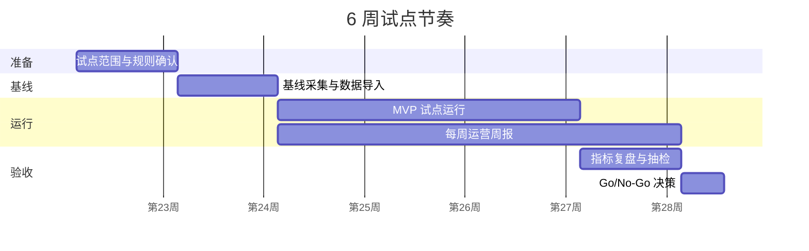
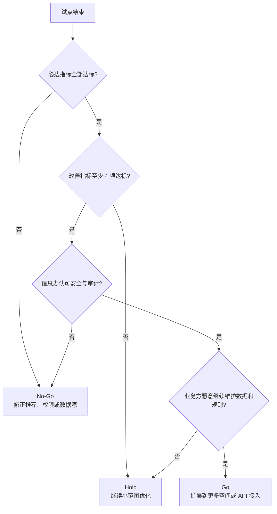

# 试点验收方案

## 一、试点目标

CampusFlow 首次试点不做全校铺开，而是验证一个可采购、可验收、可复用的业务闭环：

> 在学工处/团委主导下，以社团活动场地申请为主场景，同时覆盖学生找空间和老师审批预审，证明 CampusFlow 能减少场地申请反复沟通、缩短审批处理时间、降低场地冲突，并在数据安全边界内沉淀空间运营指标。

首个试点建议采用 **学工处/团委的社团活动场地审批效率提升** 作为采购切口。教务处空间治理和校级 BI 看板作为二期扩展价值展示。

## 二、试点范围

| 项目 | 建议范围 | 说明 |
| --- | --- | --- |
| 牵头部门 | 学工处/团委 | 负责社团活动申请规则、审批流程和试点评估 |
| 协同部门 | 场地管理部门、信息办、后勤 | 分别负责空间状态、数据权限、设备状态 |
| 试点对象 | 10-20 个高频活动社团 | 优先选择讲座、分享会、培训类活动多的社团 |
| 审批人员 | 3-5 位辅导员/团委老师/场地管理员 | 先小范围白名单使用 |
| 空间范围 | 20-50 个空间 | 包含普通教室、阶梯教室、研讨室、活动中心 |
| 试点周期 | 4-6 周 | 前 1 周采集基线，中间 3-4 周运行，最后 1 周验收 |
| 接入方式 | CSV/Excel 离线导入优先 | 不把 API 对接作为首轮试点前置条件 |

## 三、上线前置条件

| 条件 | 验收口径 | 责任方 |
| --- | --- | --- |
| 空间基础表 | 至少包含空间名、楼宇、容量、类型、设备、开放时间 | 场地管理部门 |
| 课表或占用表 | 至少覆盖试点空间未来 4-6 周占用情况 | 教务/场地管理部门 |
| 预约申请样表 | 至少提供近 1-2 个月社团场地申请记录 | 学工/团委 |
| 审批规则表 | 明确人数、外校人员、晚间活动、设备等规则 | 学工/团委 |
| 角色权限表 | 明确学生、社团负责人、老师、管理员可见范围 | 信息办 |
| 数据安全确认 | 明确不接入个人轨迹、精确门禁和敏感画像 | 信息办 |
| 人工兜底流程 | 明确推荐错误、数据冲突、紧急占用时的人工处理人 | 业务负责人 |

## 四、基线采集

试点前至少采集 1 周基线数据。若学校已有历史申请数据，建议抽取近 1 个月作为补充。

| 基线指标 | 采集方式 | 样本要求 |
| --- | --- | --- |
| 社团申请平均填写耗时 | 观察 5-10 次申请或让社团负责人自报计时 | 至少 10 条 |
| 申请平均审批时长 | 从提交到审批完成的系统/表格时间差 | 至少 20 条 |
| 申请一次通过率 | 首次提交未被退回的申请数 / 总申请数 | 至少 20 条 |
| 平均退回次数 | 每条申请被退回补材料或改时间次数 | 至少 20 条 |
| 管理员核对时间 | 老师/管理员核对课表、设备、规则的耗时 | 至少 10 条 |
| 场地冲突率 | 因课表、预约、设备、开放时间产生冲突的申请比例 | 至少 20 条 |
| 用户满意度 | 学生/社团负责人 1-5 分评分 | 至少 20 人 |

没有历史系统数据时，可以用“人工抽样 + 表格记录”的方式建立试点基线，避免因系统未打通而无法验收。

## 五、试点验收指标

### 5.1 必达指标

| 指标 | 目标值 | 计算方式 | 数据来源 |
| --- | --- | --- | --- |
| 申请单字段完整率 | ≥ 85% | AI 生成后关键字段完整的申请数 / AI 生成申请总数 | 申请记录抽检 |
| 风险识别命中率 | ≥ 80% | AI 正确识别人数、外校嘉宾、晚间、设备等风险项数 / 应识别风险项数 | 老师抽检 |
| 场地推荐人工抽检通过率 | ≥ 90% | 老师认为推荐合理的样本数 / 抽检推荐样本数 | 老师/管理员抽检 |
| 人工审批保留率 | 100% | 中高风险申请必须经过人工确认 | 审批日志 |
| 审计日志完整率 | 100% | 查询、推荐、提交、审批动作均有日志 | 系统日志 |

### 5.2 改善指标

| 指标 | 目标值 | 计算方式 | 数据来源 |
| --- | --- | --- | --- |
| 社团申请一次通过率 | 提升 ≥ 30% | 试点后一次通过率 / 基线一次通过率 - 1 | 申请记录 |
| 平均审批处理时长 | 降低 ≥ 30% | 1 - 试点后平均时长 / 基线平均时长 | 审批记录 |
| 管理员人工核对时间 | 降低 ≥ 40% | 1 - 试点后核对耗时 / 基线核对耗时 | 人工计时 |
| 场地冲突率 | 降低 ≥ 20% | 1 - 试点后冲突率 / 基线冲突率 | 推荐与申请记录 |
| 推荐采纳率 | ≥ 60% | 用户选择推荐场地或提交申请数 / 推荐结果展示数 | 行为日志 |
| 用户点踩率 | ≤ 10% | 负反馈次数 / 推荐结果展示数 | 用户反馈 |

### 5.3 管理价值指标

| 指标 | 目标值 | 说明 |
| --- | --- | --- |
| 周报稳定生成 | 连续 4 周 | 每周输出冲突排行、退回原因、下周建议 |
| 退回原因可归因 | 覆盖 ≥ 80% 退回申请 | 能归因到材料缺失、时间冲突、设备不满足等 |
| 扩展意愿 | 至少 1 个部门提出扩展场景 | 如教务处希望接入自习空间或教室利用率 |

## 六、数据分类与安全边界

依据《教育数据分类分级指南》（JY/T 0661-2025）的分类分级思路，试点阶段采用最小化数据原则：能用空间级数据解决的问题，不使用个人级数据；能离线导入解决的问题，不强制实时接口。

| 数据类型 | 示例字段 | 试点处理方式 | 风险等级判断 | 控制措施 |
| --- | --- | --- | --- | --- |
| 公开空间数据 | 楼宇、教室名、容量、类型、设备、开放时间 | 可用于学生端展示 | 低 | 展示数据更新时间 |
| 教学占用数据 | 课程占用时段、考试占用时段、空间 ID | 只用于判断空间可用性 | 中 | 不展示课程学生名单 |
| 预约申请数据 | 活动名称、人数、时间、设备、申请状态 | 用于推荐、预审、审批 | 中 | 按角色展示，留痕审计 |
| 外校嘉宾信息 | 嘉宾人数、名单附件状态 | MVP 只展示是否已上传，不展示名单明细 | 中高 | 文件仍走学校原审批系统 |
| 设备状态数据 | 投影、麦克风、音响、维修状态 | 用于过滤不可用空间 | 中 | 仅展示设备状态，不展示维修人员隐私 |
| 用户角色数据 | 用户 ID、角色、所属组织、权限范围 | 用于权限控制 | 中 | 仅系统内部使用 |
| 个人轨迹数据 | 门禁记录、座位轨迹、精确到人流动记录 | 首轮试点不接入 | 高 | 不采集、不展示、不建模 |

## 七、权限与审计

| 角色 | 可见数据 | 不可见数据 | 可执行动作 |
| --- | --- | --- | --- |
| 学生 | 公开空间、可用状态、推荐理由 | 他人预约详情、审批规则明细、个人轨迹 | 查询、预约、反馈 |
| 社团负责人 | 可申请场地、本人申请、材料清单、审批状态 | 其他社团申请详情、老师处理备注 | 生成申请、提交、补材料 |
| 老师/审批人 | 待审申请、AI 预审、风险项、数据来源 | 非授权学院申请、个人轨迹 | 通过、退回、调整、拒绝 |
| 场地管理员 | 空间占用、冲突、替代推荐、设备状态 | 学生个人隐私、非相关审批附件 | 调度、标记不可用、确认场地 |
| 信息办 | 数据源、权限表、审计日志 | 业务审批结论不由信息办修改 | 配置权限、查看日志、停用接口 |
| 管理者 | 汇总指标、周报、趋势、冲突排行 | 个人级明细、敏感附件 | 查看分析、提出扩展需求 |

所有 AI 推荐、字段生成、风险判断、用户确认、审批操作均写入日志。日志至少记录：时间、用户角色、动作类型、输入摘要、数据源版本、输出结果、人工修改内容。

## 八、试点运行节奏

| 周期 | 任务 | 产出 |
| --- | --- | --- |
| 第 0 周 | 明确试点范围、数据字段、审批规则、权限边界 | 试点启动清单 |
| 第 1 周 | 采集基线数据，导入 Mock/CSV 数据，完成老师和社团培训 | 基线报告、初始数据包 |
| 第 2-4 周 | 运行找空间、活动申请预审、老师审批工作台 | 每周运营周报 |
| 第 5 周 | 汇总指标、抽检样本、复盘误判和数据缺口 | 试点验收报告 |
| 第 6 周 | 决策是否扩展到更多空间或接入 API | PMF 扩展建议 |

## 九、验收会议材料

验收会建议准备 6 份材料：

1. 试点范围和参与角色清单。
2. 试点前后指标对比表。
3. AI 推荐和风险预审抽检表。
4. 数据安全与权限审计说明。
5. 典型案例：一次成功申请、一次退回补材料、一次场地冲突调度。
6. 下一阶段扩展建议：教务空间治理、设备报修联动、BI 周报。

## 十、Go / No-Go 判断

### 可以扩展的条件

1. 必达指标全部达标。
2. 改善指标至少 4 项达标。
3. 老师和管理员没有提出不可接受的安全或流程风险。
4. 信息办认可当前数据最小化和审计方式。
5. 业务方愿意继续提供数据和规则维护人。

### 暂缓扩展的条件

1. 推荐准确率低于 80%。
2. 中高风险申请出现 AI 绕过人工审批的情况。
3. 数据源无法稳定更新，导致大量错误推荐。
4. 信息办认为权限和日志无法满足校内要求。
5. 用户反馈集中指向“比原流程更麻烦”。

## 十一、资料依据

- 教育部召开国家教育数字化战略行动 2025 年部署会，以“人工智能与教育变革”为主题，推动教育数字化转型。
- 教育部等五部门联合印发《“人工智能+教育”行动计划》，强调智能技术与教育全要素融合、全过程贯通、全场景覆盖。
- 《教育数据分类分级指南》（JY/T 0661-2025）已发布并于 2026 年 2 月 18 日实施，为教育数据分类分级和最小化使用提供依据。
- FineBI / FineChatBI 的自然语言问数和 BI 分析能力，可作为后续“运营问数、周报、指标归因”的演示或集成方向。

## 十二、结论

试点验收的关键不是证明 CampusFlow 能回答多少问题，而是证明它能在真实学校流程里减少反复沟通、提升审批效率、降低空间冲突，并且不突破数据安全和人工审批边界。

首轮试点只要跑通“社团活动申请预审 + 老师人工确认 + 空间运营周报”这一条主链路，就足以支撑后续从学工/团委切入，逐步扩展到教务空间治理和校级空间运营分析。
