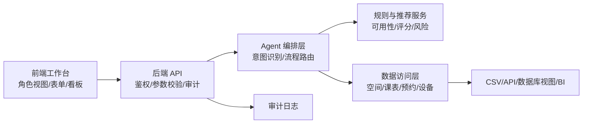
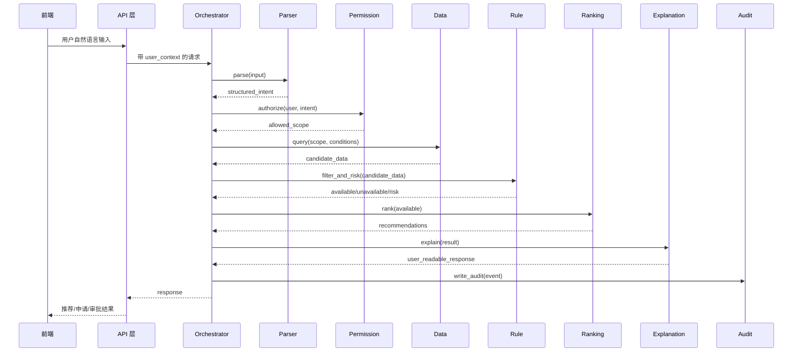
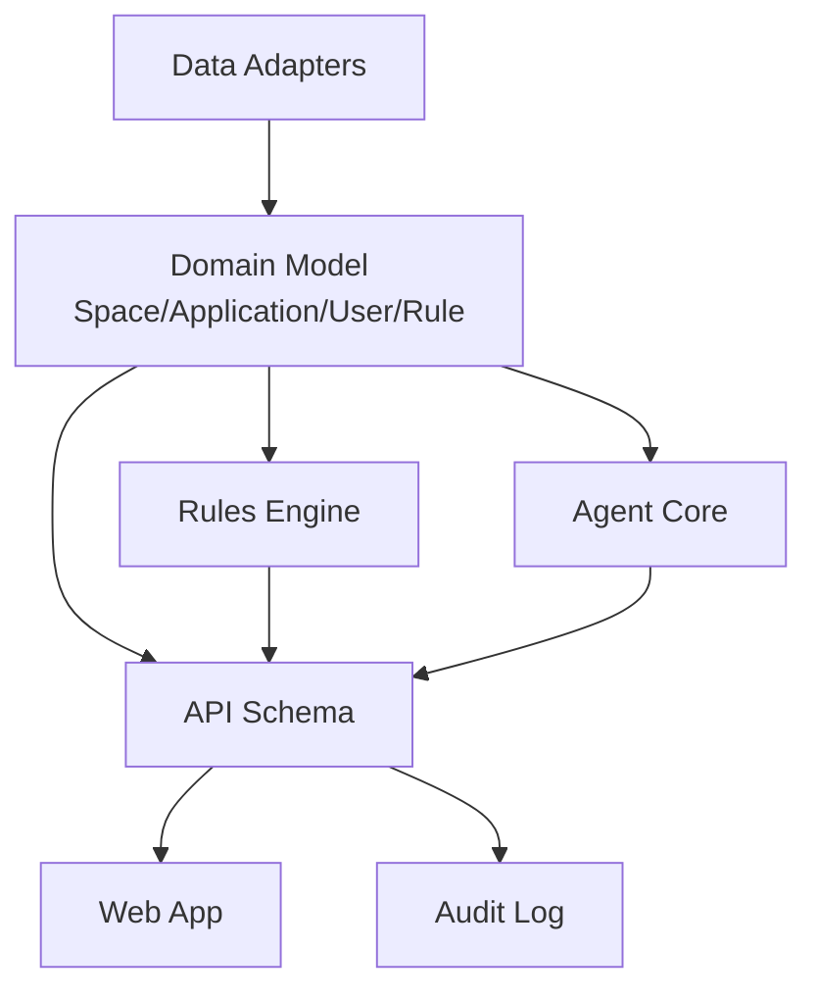

# 研发可行性与工程治理评审

## 一、评审结论

从研发视角看，CampusFlow 适合按 **前后端解耦 + Workflow Agent 编排 + 规则引擎兜底 + 审计日志闭环** 的方式推进。

当前方案在业务场景、AI 边界、数据模型、权限审计和试点验收上已经比较完整；还需要补强的是工程化表达，包括前后端接口边界、Agent 间协议、Git 协作规范、代码维护策略，以及场景/异常清单的研发验收口径。

建议研发落地顺序：

1. 先做静态 Demo 和可测试规则引擎。
2. 再做后端 API 层和 CSV/Excel 数据导入。
3. 再接入真实身份、权限、审批流和日志。
4. 最后扩展 API/数据库视图/BI 平台集成。

## 二、前后端解耦检查

### 2.1 当前判断

现有 Demo 是静态页面，`app.js` 承担了 Mock 数据、页面状态、业务逻辑和渲染；`src/engine.js` 已经抽出了可测试的推荐、风险预审和演示流程逻辑。这说明方案已经具备初步解耦意识，但还没有形成正式前后端 API 契约。

### 2.2 研发风险

| 风险 | 表现 | 影响 |
| --- | --- | --- |
| 页面直接依赖 Mock 数据 | Demo 能跑，但真实试点无法直接替换数据源 | 后续重构成本上升 |
| 业务规则散落前端 | 规则变更需要改页面代码 | 维护困难 |
| 权限只在前端展示 | 无法防止越权访问 | 信息办难以接受 |
| 状态联动仅本地模拟 | 指标不能追溯到行为日志 | 验收数据可信度不足 |

### 2.3 建议架构



### 2.4 API 边界建议

| 前端调用 | 后端职责 | 不放在前端的内容 |
| --- | --- | --- |
| `POST /api/intent/parse` | 解析意图，返回结构化参数和置信度 | Prompt、模型 Key、完整规则 |
| `POST /api/spaces/recommend` | 权限校验、查数据、规则过滤、评分排序 | 可见范围判断、原始课表明细 |
| `POST /api/applications/draft` | 生成申请草稿、材料清单和风险项 | 审批规则实现细节 |
| `POST /api/applications/{id}/submit` | 提交申请并写入审计 | 绕过审批的直接写入 |
| `POST /api/reviews/{id}/decision` | 审批通过、退回、调场、拒绝 | 前端直接改状态 |
| `GET /api/operations/summary` | 汇总指标、冲突排行、周报草稿 | 个人级行为轨迹 |
| `POST /api/feedback` | 记录预约、采纳、点踩、反馈 | 本地不可追踪状态 |

### 2.5 数据传输原则

前端只拿“当前角色可见的数据”。后端负责：

1. 身份认证和角色判断。
2. 权限范围过滤。
3. 数据脱敏。
4. 规则执行。
5. 审计记录。
6. 错误码和降级提示。

## 三、Agent 之间的接口设计

### 3.1 Agent 不建议拆成黑盒自治体

本项目不适合设计成多个自由通信的自主 Agent。更稳的做法是 **Workflow Agent + 工具函数/服务接口**：

1. Orchestrator Agent：负责识别意图、决定调用哪个能力。
2. Parser Tool：负责结构化参数抽取。
3. Permission Tool：负责用户、角色、空间范围校验。
4. Data Tool：负责查询空间、课表、预约、设备。
5. Rule Tool：负责硬规则过滤和风险判断。
6. Ranking Tool：负责推荐评分。
7. Explanation Tool：负责生成面向用户的解释。
8. Audit Tool：负责日志写入。

### 3.2 推荐调用链



### 3.3 Agent 输入输出协议草案

#### 通用请求上下文

```json
{
  "request_id": "req_20260601_001",
  "user": {
    "user_id": "u_001",
    "role": "club_leader",
    "department": "人工智能协会",
    "permission_scope": ["east_campus", "activity_center"]
  },
  "input": "周五 19:00 办 80 人 AI 分享会，要投影、麦克风，有 5 个外校嘉宾。",
  "client_context": {
    "source": "web_demo",
    "locale": "zh-CN"
  }
}
```

#### Parser 输出

```json
{
  "intent": "event_application",
  "confidence": 0.91,
  "missing_fields": [],
  "parameters": {
    "date": "2026-06-05",
    "start": "19:00",
    "end": "21:30",
    "capacity": 80,
    "equipment": ["projector", "microphone"],
    "external_guests": true,
    "external_guest_count": 5
  }
}
```

#### Recommendation 输出

```json
{
  "request_id": "req_20260601_001",
  "status": "ok",
  "recommendations": [
    {
      "space_id": "S201",
      "space_name": "学生活动中心 201 报告厅",
      "score": 88,
      "reasons": ["容量满足", "设备匹配", "当前时段无冲突"],
      "data_sources": ["space_basic", "course_schedule", "reservations"]
    }
  ],
  "unavailable": [
    {
      "space_id": "A102",
      "reasons": ["课程冲突：大学英语课程 19:00-21:00"]
    }
  ],
  "risk": {
    "level": "medium",
    "items": ["人数超过 50", "存在外校嘉宾"],
    "must_manual_review": true
  }
}
```

### 3.4 错误码建议

| 错误码 | 场景 | 前端处理 |
| --- | --- | --- |
| `MISSING_FIELD` | 缺少时间、人数、设备等关键参数 | 追问补充 |
| `PERMISSION_DENIED` | 用户无权查询或申请该空间 | 提示权限限制 |
| `DATA_STALE` | 数据超过更新时间阈值 | 展示更新时间并建议人工确认 |
| `NO_MATCH` | 没有完全匹配空间 | 返回替代方案 |
| `RISK_REQUIRES_MANUAL` | 中高风险申请 | 禁止自动通过，进入人工审批 |
| `SOURCE_UNAVAILABLE` | 课表、预约、设备数据不可用 | 降级到人工联系入口 |

## 四、Git 仓库引入、角色分配与协作性

### 4.1 当前缺口

现有方案更偏产品和试点交付，还没有明确 Git 仓库结构、分支策略、评审规则和研发角色分工。若进入真实研发，这是必须补的一项。

### 4.2 推荐仓库结构

```text
campusflow/
  apps/
    web/                 # 前端工作台
    api/                 # 后端 API 服务
  packages/
    domain/              # 共享类型、领域模型、校验 schema
    agent-core/          # Agent 编排、Prompt、工具接口
    rules-engine/        # 可用性、风险、评分规则
    data-adapters/       # CSV/API/数据库/BI 适配器
  docs/
    api/                 # OpenAPI、接口说明
    product/             # PRD、试点验收、答辩材料
    ops/                 # 部署、权限、审计、数据导入说明
  tests/
    fixtures/            # Mock 数据和验收样例
```

### 4.3 分支与提交策略

| 项目 | 建议 |
| --- | --- |
| 主分支 | `main` 只放可演示、可部署版本 |
| 开发分支 | `develop` 汇总已评审功能 |
| 功能分支 | `feature/role-workbench`、`feature/rules-engine` |
| 修复分支 | `fix/recommendation-conflict` |
| 提交规范 | `feat:`、`fix:`、`docs:`、`test:`、`refactor:` |
| 合并方式 | Pull Request + 至少 1 人 Review |
| 发布标签 | `demo-v1`、`pilot-v0.1`、`pilot-v0.2` |

### 4.4 研发角色分配

| 角色 | 主要职责 | 交付物 |
| --- | --- | --- |
| 产品负责人 | 维护 PRD、场景边界、验收指标 | PRD、用户故事、验收清单 |
| 前端工程师 | 多角色工作台、表单、看板、演示模式 | `apps/web` |
| 后端工程师 | API、权限、审批状态、审计日志 | `apps/api` |
| AI/Agent 工程师 | 意图识别、结构化输出、提示词、评测集 | `packages/agent-core` |
| 规则引擎工程师 | 空间过滤、评分、风险规则配置化 | `packages/rules-engine` |
| 数据工程师 | CSV 导入、数据清洗、数据适配器 | `packages/data-adapters` |
| 测试/QA | 流程测试、异常测试、权限测试、回归测试 | 测试用例、缺陷报告 |
| 信息安全/信息办接口人 | 数据分级、权限审计、日志要求 | 安全评审清单 |

### 4.5 协作机制

1. 每个场景必须先写用户故事和验收条件。
2. 接口变更必须同步 OpenAPI 或 JSON Schema。
3. 规则变更必须有规则 ID、版本号和测试样例。
4. Prompt 变更必须记录版本、输入样例和输出对比。
5. 每周试点复盘要同步缺陷、误判、数据缺口和规则调整。

## 五、代码后续可维护性

### 5.1 维护风险

| 风险 | 典型表现 | 解决方式 |
| --- | --- | --- |
| 规则硬编码 | 不同学校规则不同，代码改不动 | 规则配置化，保留规则版本 |
| Prompt 不可控 | 改一次提示词影响多个场景 | Prompt 版本化 + 回归样例 |
| 前端状态膨胀 | 多角色页面互相影响 | 角色视图和业务状态分模块 |
| 数据适配混乱 | CSV、API、BI 字段不一致 | 统一领域模型和 adapter |
| 无审计链路 | 出错后无法追责 | 全链路 request_id 和日志 |
| 测试样例不足 | 推荐结果改坏无人发现 | fixtures + 单元测试 + 场景测试 |

### 5.2 建议模块边界



### 5.3 测试策略

| 测试类型 | 覆盖内容 | 示例 |
| --- | --- | --- |
| 单元测试 | 时间冲突、容量、设备、风险规则 | `A102` 周五 19:00 课程冲突 |
| Contract 测试 | 前后端接口字段和错误码 | `RecommendationResponse` schema |
| Agent 输出测试 | 意图、参数、缺失字段、置信度 | 80 人活动外校嘉宾识别 |
| 权限测试 | 学生、社团、老师、管理员可见范围 | 学生不可见他人预约详情 |
| 审计测试 | 查询、推荐、提交、审批日志 | 每个动作有 `request_id` |
| E2E 测试 | 找空间、申请、审批、调场、周报 | 四角色主链路 |

### 5.4 可维护性硬要求

1. 所有核心接口有 JSON Schema 或 OpenAPI。
2. 所有规则有 `rule_id`、描述、输入字段、输出动作和版本。
3. 所有 AI 输出必须能映射到结构化字段，不允许只返回自然语言。
4. 所有推荐结果必须有数据来源和更新时间。
5. 所有高风险动作必须要求人工确认。
6. 所有线上 Prompt 变更必须经过样例回归。
7. 所有审批状态变更必须写审计日志。

## 六、场景、流程、边界与意外情况检查

### 6.1 场景覆盖清单

| 场景 | 当前覆盖度 | 研发判断 |
| --- | --- | --- |
| 学生自然语言找自习/讨论空间 | 已覆盖 | P0，应保留 |
| 社团负责人申请活动场地 | 已覆盖 | P0，应保留 |
| 老师查看 AI 预审并审批 | 已覆盖 | P0，应保留 |
| 管理员处理空间冲突 | 已覆盖 | P1，可试点弱化 |
| 管理者看 BI 周报 | 已覆盖演示 | P1，不作为首轮验收核心 |
| 后勤设备维修联动 | 部分覆盖 | P1/P2，先用设备状态字段 |
| 信息办权限和审计 | 已写原则 | P0，需要工程化实现 |
| 教务处全校空间治理 | 作为扩展 | 暂不进入首轮 MVP |

### 6.2 主流程清单

1. 找空间：输入需求 → 参数抽取 → 权限校验 → 查询数据 → 规则过滤 → 排序解释 → 预约/反馈。
2. 活动申请：输入活动 → 生成申请字段 → 推荐场地 → 风险预审 → 用户确认 → 老师审批。
3. 老师审批：查看队列 → 查看风险和来源 → 通过/退回/调场/拒绝 → 写日志。
4. 管理员调度：查看冲突 → 查看替代空间 → 标记不可用/调场 → 更新周报。
5. 运营复盘：汇总指标 → 归因退回和冲突 → 输出周报 → 调整规则。

### 6.3 明确不做边界

| 不做内容 | 原因 |
| --- | --- |
| AI 自动批准中高风险活动 | 审批责任和安全风险高 |
| 个人门禁、座位轨迹、精确到人流动分析 | 数据敏感，试点不需要 |
| 作业、心理、处分等通用校园问答 | 场景边界过宽且风险高 |
| 直接替换学校 OA/教务系统 | 集成成本过高，采购阻力大 |
| 全校实时空间治理首发 | 跨部门复杂度高，不利于试点验证 |

### 6.4 意外情况与兜底

| 意外情况 | 系统处理 | 是否阻断 |
| --- | --- | --- |
| 缺少时间 | 追问补充时间 | 阻断推荐 |
| 缺少人数 | 追问预计人数 | 阻断申请 |
| 无完全匹配空间 | 给替代方案并解释差异 | 不阻断 |
| 数据源过期 | 展示更新时间，要求人工确认 | 阻断自动提交 |
| 课表和预约冲突 | 默认不可用并显示来源 | 阻断推荐 |
| 用户越权查询 | 拒绝展示并写审计 | 阻断 |
| 高风险活动 | 强制人工审批 | 阻断自动通过 |
| 模型置信度低 | 只给建议，不提交申请 | 阻断提交 |
| 审批规则缺失 | 标记待人工判断 | 阻断自动预审 |
| 外校嘉宾名单未上传 | 允许草稿，不允许提交 | 阻断提交 |
| 设备状态未知 | 降级为需管理员确认 | 阻断自动推荐为首选 |
| 并发预约冲突 | 提交前二次校验 | 阻断写入 |

## 七、最终研发判断

### 7.1 可行部分

1. 静态 Demo：已完成，适合答辩展示。
2. MVP 试点：可行，前提是 CSV/Excel 数据可获得，且试点范围小。
3. 规则推荐和风险预审：可行，首版不需要复杂机器学习。
4. 权限和审计：可行，但必须后端实现，不能只靠前端。
5. BI 周报：可行，首版可以先生成摘要草稿和固定模板。

### 7.2 需要谨慎部分

1. 多系统实时 API 接入。
2. 跨学院、跨部门审批权限。
3. 全校级空间治理。
4. 个人轨迹、门禁、座位级数据。
5. 自动化审批闭环。

### 7.3 建议答辩表述

> 从研发上，我不会把 CampusFlow 做成一个大而全的自主 Agent，而是做成可控的 Workflow Agent。前端只负责角色工作台和交互展示，后端负责鉴权、规则、数据查询、审批状态和审计日志。Agent 之间不直接自由通信，而是通过结构化接口调用 Parser、Permission、Data、Rule、Ranking、Explanation、Audit 等工具。这样既能利用大模型降低自然语言入口门槛，也能保证关键业务动作可测试、可追踪、可人工接管。

> 如果进入真实试点，我会先建立 Git 仓库和模块边界，把前端、API、Agent Core、规则引擎、数据适配器拆开；同时用 OpenAPI/JSON Schema 管接口，用规则 ID 管审批规则，用 Prompt 版本和测试样例管 AI 输出。这样后续学校规则变化、数据源变化或角色扩展时，不需要重写整个系统。
