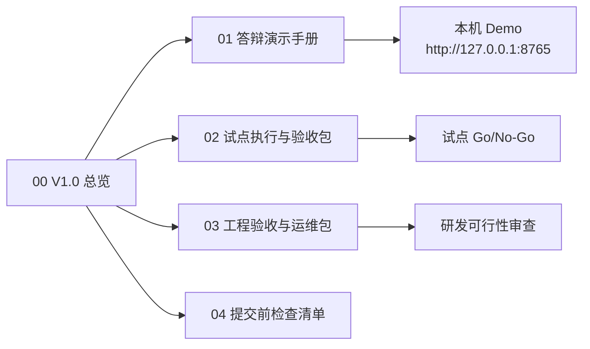

# CampusFlow V1.0 提交包总览

## 交付定位

CampusFlow V1.0 是在本机可运行 MVP 基础上整理出的正式提交包，目标是让评委、导师、业务方和研发评审都能快速判断三件事：

1. **能提交**：方案、PRD、研发说明、试点验收和 Demo 入口齐全。
2. **能答辩**：有清晰演示路径、时间脚本和预设问答。
3. **能试点**：有范围、数据边界、验收指标、运维方式和 Go/No-Go 决策口径。

## 一句话介绍

CampusFlow 是面向高校教务、学工、团委和场地管理部门的校园空间预约与审批智能调度助手，把“找空间、发申请、老师审批、管理员复盘”从人工查询与表格流转升级为可解释、可追踪、可验收的 AI 工作流。

## V1.0 交付物阅读顺序



## 提交包目录

| 文件 | 用途 | 主要读者 |
| --- | --- | --- |
| `00_V1.0提交包总览.md` | 说明提交包边界、阅读顺序、完成度 | 评委、导师、项目负责人 |
| `01_答辩演示手册.md` | 提供 3 分钟/10 分钟脚本、Demo 路径、问答钩子 | 答辩人、演示人 |
| `02_试点执行与验收包.md` | 明确试点范围、周期、指标、验收闸门 | 学校业务方、信息办、采购评审 |
| `03_工程验收与运维包.md` | 说明架构、API、数据、权限、运维和可维护性 | 研发评审、技术负责人 |
| `04_提交前检查清单.md` | 提交前逐项确认材料、Demo、风险与口径 | 提交人 |

## 已有基础材料索引

| 材料 | 位置 | V1.0 中的作用 |
| --- | --- | --- |
| 最终交付物总览 | `deliverables/00_最终交付物总览.md` | 完整方案阅读地图 |
| 调研与需求分析 | `deliverables/01_调研与需求分析.md` | 需求真实性与优先级证明 |
| PRD | `deliverables/02_PRD_校园空间预约与审批智能调度助手.md` | 产品功能、流程、数据与 AI 边界 |
| 运营推广方案 | `deliverables/03_运营推广方案.md` | 试点推广与采购切口 |
| Demo 方案 | `deliverables/04_Demo方案与演示脚本.md` | 原型演示结构与话术 |
| 试点验收方案 | `deliverables/05_试点验收方案.md` | 试点指标与验收逻辑 |
| 答辩模拟稿 | `deliverables/06_答辩模拟稿.md` | 预想问题与答复 |
| 研发评审 | `deliverables/07_研发可行性与工程治理评审.md` | 研发可行性、协作、维护与边界 |
| 本机 MVP | `apps/` | 可运行产品证明 |

## 可运行证明

V1.0 不是纯文档方案，已经包含一个本机后端 MVP：

- 本地 API：`apps/api/campusflow/server.py`
- SQLite 持久化：`apps/campusflow.sqlite3`
- 前端工作台：`apps/web/index.html`
- 自动化测试：`apps/api/tests/`
- 运行说明：`apps/README.md`

启动命令：

```bash
PYTHONPATH=apps/api python -m campusflow.server
```

访问地址：

```text
http://127.0.0.1:8765
```

## V1.0 范围边界

### 已实现并可演示

- 学生自然语言找空间。
- 社团负责人生成活动申请草稿并提交。
- 老师审批通过、补材料、改期。
- 管理员查看运营指标、冲突 Top5、周报摘要和审计日志。
- 本机 SQLite 持久化。
- 一键重置演示数据。
- 基础 HTTP API 与测试覆盖。

### V1.0 作为试点准备，不承诺生产上线

- 对接真实统一身份认证。
- 对接学校正式课表、OA、预约系统。
- 消息通知、移动端、小程序。
- 多校区复杂权限治理。
- 大模型真实接入与 RAG 知识库上线。

### 明确不做

- 校园万能问答。
- AI 自动批准中高风险申请。
- 个人轨迹建模或敏感画像。
- 替代教务/OA/统一身份系统。

## 推荐提交说法

> 本项目已经从方案阶段推进到本机可运行 MVP，并整理为 V1.0 提交包。V1.0 的重点不是把所有高校系统一次性做完，而是在校园空间预约和社团活动审批这一高频、数据明确、可验收的场景中，跑通 AI 工作流、人工审批、运营复盘和工程验证闭环。

## 交付状态

| 维度 | 状态 | 证据 |
| --- | --- | --- |
| 方案完整性 | 已完成 | `deliverables/00` 至 `deliverables/07` |
| 可运行 Demo | 已完成 | `apps/` 本机服务与前端 |
| 自主测试 | 已完成 | `apps/api/tests/` |
| 答辩材料 | 已补齐 | `deliverables/v1.0/01_答辩演示手册.md` |
| 试点材料 | 已补齐 | `deliverables/v1.0/02_试点执行与验收包.md` |
| 工程材料 | 已补齐 | `deliverables/v1.0/03_工程验收与运维包.md` |
| 提交检查 | 已补齐 | `deliverables/v1.0/04_提交前检查清单.md` |
