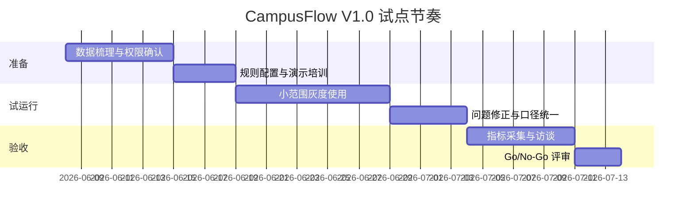
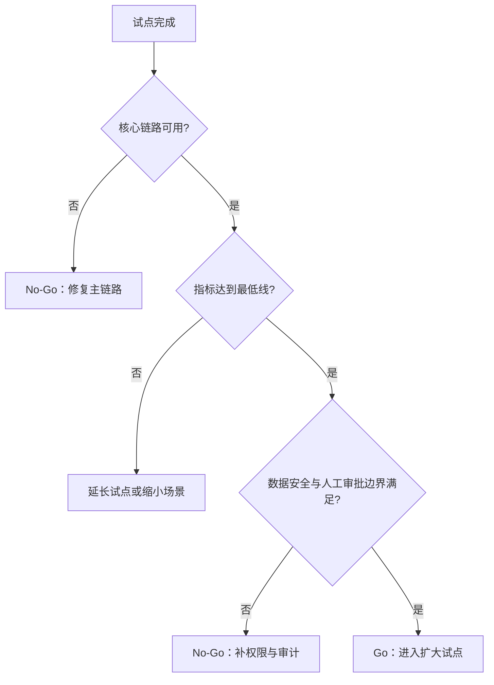

# CampusFlow V1.0 试点执行与验收包

## 试点目标

在一个学院、一个校区片区或一组楼宇内，验证 CampusFlow 是否能降低校园空间预约与活动审批的人工成本，并提升空间使用效率。

试点不追求一次性覆盖全校，而是验证两个闭环：

1. 学生/社团自然语言找空间。
2. 社团活动申请预审与老师人工审批。

## 试点范围

| 项目 | V1.0 建议范围 |
| --- | --- |
| 组织范围 | 一个学院、团委社团管理办公室，或一个校区片区 |
| 空间范围 | 10-30 个教室、研讨室、活动室、报告厅 |
| 用户范围 | 100-300 名学生、10-30 个社团负责人、3-8 名审批老师/管理员 |
| 试点周期 | 6 周 |
| 数据范围 | 空间基础表、课表、预约记录、设备状态、审批规则、反馈与审计日志 |

## 角色责任

| 角色 | 责任 |
| --- | --- |
| 业务负责人 | 确定试点空间、审批规则、验收指标 |
| 信息办/数据负责人 | 提供数据源、权限范围、安全要求 |
| 场地管理员 | 维护空间状态、确认冲突与调场结果 |
| 审批老师 | 使用审批工作台处理申请 |
| 试点学生/社团 | 使用找空间与活动申请功能，提交反馈 |
| 项目组 | 部署 Demo、收集日志、形成试点报告 |

## 6 周执行计划

## 数据准备清单

| 数据表 | 必填字段 | 说明 |
| --- | --- | --- |
| 空间基础表 | 空间 ID、名称、楼宇、容量、类型、设备、开放时间、权限范围 | 推荐和过滤的基础 |
| 课表 | 空间 ID、日期、开始时间、结束时间、课程名称 | 排除课程占用 |
| 预约记录 | 空间 ID、申请人、状态、时间、活动类型、人数 | 排除已批准预约 |
| 设备状态 | 空间 ID、设备名称、状态、影响等级 | 判断设备不可用 |
| 审批规则 | 人数阈值、外校人员规则、时间规则、审批人 | 生成风险与材料清单 |
| 审计日志 | 操作人、角色、动作、输入摘要、输出摘要、时间 | 追责和复盘 |

## 基线采集

试点开始前至少采集 1-2 周基线：

| 指标 | 采集方式 | 基线问题 |
| --- | --- | --- |
| 找空间平均耗时 | 用户问卷或系统记录 | 学生从开始查找到确定空间需要多久 |
| 活动申请一次通过率 | 历史审批记录 | 多少申请首次提交即可通过 |
| 平均审批处理时长 | 审批记录 | 老师从收到到处理需要多久 |
| 冲突/退回原因 | 退回记录和访谈 | 哪些空间、时段、材料最常出问题 |
| 空间利用率 | 预约与课表数据 | 哪些时段和空间闲置或拥堵 |

## V1.0 验收指标

| 指标 | 目标值 | 说明 |
| --- | --- | --- |
| 找空间平均耗时 | 降低 30% 以上 | 与基线相比 |
| 推荐采纳率 | 不低于 50% | 用户点击采纳或按推荐提交 |
| 活动申请一次通过率 | 提升 20% 以上 | 与基线相比 |
| 审批处理时长 | 降低 20% 以上 | AI 预审减少重复核对 |
| 冲突申请占比 | 降低 15% 以上 | 课表/预约/设备冲突减少 |
| 审计日志完整率 | 100% | 关键动作必须可追踪 |

## 验收闸门

## 最低通过标准

V1.0 试点可进入下一阶段，需要同时满足：

1. 学生找空间、社团申请、老师审批、管理员复盘四角色链路稳定。
2. 权限校验和审计日志覆盖所有关键动作。
3. 至少 3 个核心效率指标相比基线改善。
4. 业务方认可推荐理由和审批风险提示有实际帮助。
5. 信息办认可数据边界和人工审批边界。

## 风险与处理

| 风险 | 表现 | 处理方式 |
| --- | --- | --- |
| 数据质量不足 | 空间、课表、预约状态不一致 | 先限定试点楼宇，建立数据责任人 |
| 审批规则不统一 | 不同老师口径不同 | 先抽象为规则表，无法结构化的保留人工判断 |
| 用户不信任推荐 | 只看结果，不懂依据 | 强化推荐理由、不可用原因和数据来源 |
| 演示和试点混淆 | 评审误认为可直接生产上线 | 明确 V1.0 是本机 MVP 与试点准备包 |
| AI 边界被质疑 | 担心自动决策 | 强调 AI 不自动批准中高风险申请 |

## 试点报告模板

试点结束后输出：

1. 试点范围与数据源说明。
2. 基线指标与试点指标对比。
3. 四角色使用反馈。
4. 典型成功案例和失败案例。
5. 数据安全与权限审计结果。
6. Go/No-Go 建议。
7. 下一阶段功能清单。
