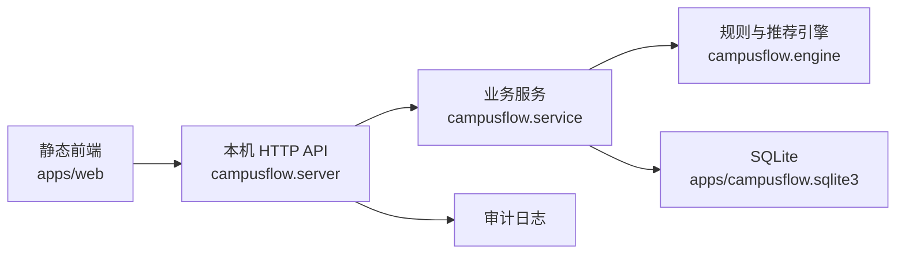
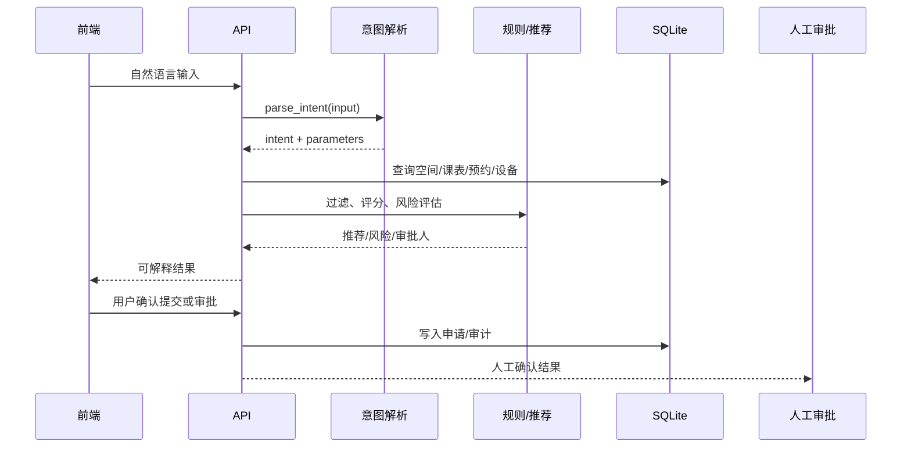

# CampusFlow V1.0 工程验收与运维包

## 工程定位

CampusFlow V1.0 工程实现是一个本机可运行 MVP，用于证明产品主链路、数据持久化、前后端联调、角色工作台和自主测试可行。它不是生产部署版本，但代码结构已经按后续接入真实系统的方向拆分。

## 当前架构



## 文件职责

| 文件 | 职责 |
| --- | --- |
| `apps/api/campusflow/db.py` | SQLite schema、种子数据、重置演示数据、JSON 序列化 |
| `apps/api/campusflow/engine.py` | 意图解析、推荐评分、冲突过滤、风险评估、工作流说明 |
| `apps/api/campusflow/service.py` | 申请、审批、反馈、运营汇总、审计写入 |
| `apps/api/campusflow/server.py` | HTTP API、角色上下文、静态资源服务 |
| `apps/web/index.html` | 前端页面结构 |
| `apps/web/app.js` | 角色切换、API 调用、结果渲染、演示重置 |
| `apps/web/styles.css` | 帆软风格工作台样式 |
| `apps/api/tests/` | 引擎、服务、HTTP 联调测试 |

## 前后端解耦

前端只通过 HTTP JSON API 与后端通信，不直接读取 SQLite，也不包含核心推荐规则。后续接入真实后端时，可以保留前端工作台结构，替换 API 实现。

主要 API：

| API | 方法 | 用途 |
| --- | --- | --- |
| `/api/health` | GET | 服务健康检查 |
| `/api/roles` | GET | 获取角色 |
| `/api/intent/parse` | POST | 自然语言意图解析 |
| `/api/spaces/recommend` | POST | 空间推荐 |
| `/api/applications/draft` | POST | 申请草稿生成 |
| `/api/applications/submit` | POST | 提交活动申请 |
| `/api/applications` | GET | 查询申请列表 |
| `/api/reviews/{id}/decision` | POST | 审批决策 |
| `/api/operations/summary` | GET | 运营汇总 |
| `/api/feedback` | POST | 记录采纳/反馈 |
| `/api/audit` | GET | 审计日志 |
| `/api/demo/reset` | POST | 重置演示数据 |

## Agent 接口设计

V1.0 中 Agent 被拆成确定性步骤，而不是黑盒自主执行：



接口边界：

- LLM/Agent 输出必须转成结构化参数。
- 数据查询必须走数据库或权威 API。
- 规则过滤和权限校验不交给模型自由发挥。
- 中高风险动作必须进入人工审批。
- 所有关键动作写入审计日志。

## RBAC 与权限

| 角色 | 后端角色 | 能力 |
| --- | --- | --- |
| 学生 | `student` | 找空间、反馈，不可提交活动申请 |
| 社团负责人 | `club_leader` | 找空间、生成草稿、提交活动申请 |
| 老师 | `teacher` | 查看申请、审批通过/退回/改期 |
| 管理员 | `admin` | 查看运营汇总、审计、重置演示数据 |

V1.0 测试已覆盖学生提交活动申请被拒绝、老师可以审批、管理员可以重置演示数据。

## 数据边界

当前 SQLite 表：

- `spaces`
- `course_schedule`
- `reservations`
- `maintenance_ticket`
- `applications`
- `feedback_log`
- `audit_log`

不接入：

- 门禁轨迹。
- 个人敏感画像。
- 心理、处分、成绩等高风险数据。

## 运行与维护

启动：

```bash
PYTHONPATH=apps/api python -m campusflow.server
```

测试：

```bash
PYTHONPATH=apps/api python -m unittest discover -s apps/api/tests -v
```

重置演示数据：

```bash
curl -X POST http://127.0.0.1:8765/api/demo/reset ^
  -H "Content-Type: application/json" ^
  -d "{\"role\":\"管理员\"}"
```

或者在前端点击“重置演示”。

## 后续生产化路线

| 阶段 | 目标 | 关键工作 |
| --- | --- | --- |
| V1.0 本机 MVP | 证明链路可行 | 本机 API、SQLite、Demo、测试 |
| V1.1 试点版 | 接入试点数据 | 权威空间表、课表、预约记录、统一身份只读集成 |
| V1.2 工作流版 | 接入审批系统 | OA/预约系统写入、通知、审批流状态同步 |
| V2.0 平台版 | 多校区扩展 | 多租户、权限中心、BI 看板、RAG 规则库 |

## 工程验收标准

| 验收项 | 标准 |
| --- | --- |
| 本机启动 | `http://127.0.0.1:8765` 可访问 |
| API 主链路 | 推荐、提交、审批、运营、审计全部响应 |
| 数据持久化 | 跨请求能查询申请与审计记录 |
| 权限边界 | 学生不能提交活动申请，管理员才能重置演示 |
| 测试 | `unittest discover` 全部通过 |
| 可维护性 | 引擎、服务、数据库、HTTP、前端职责分离 |

## 已知限制

1. V1.0 使用规则解析模拟 LLM，不接真实大模型。
2. SQLite 适合 Demo 和试点验证，不适合作为生产数据库。
3. 角色身份由 Demo payload 指定，生产版需要统一身份认证。
4. 运营指标为试点样例算法，生产版需接真实 BI 口径。
