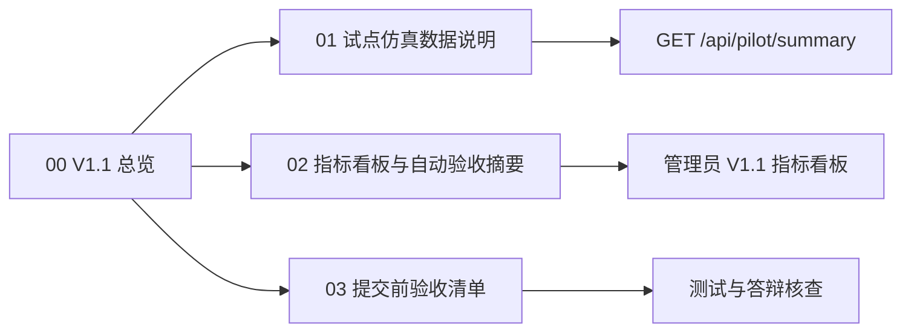

# CampusFlow V1.1 评审版总览

## 版本定位

CampusFlow V1.1 在 V1.0 本机 MVP 基础上，补齐评审最常追问的三类证据：

| 新增能力 | 交付内容 | 评审价值 |
| --- | --- | --- |
| 试点仿真数据 | 6 周试点样本、基线值、当前值、改善率 | 证明指标不是空泛承诺 |
| 指标看板 | 管理员页展示效率、冲突、通过率和验收门槛 | 让评委一屏看到试点成效 |
| 自动验收摘要 | `/api/pilot/summary` 返回 Go/No-Go、验收门槛、周报 | 让答辩结论可复现、可追踪 |

## 一句话介绍

V1.1 评审版把 CampusFlow 从“能跑通主链路”升级为“能展示试点成效、能解释指标来源、能输出自动验收结论”的提交版本。

## V1.1 阅读顺序

## 本次升级清单

| 模块 | V1.0 | V1.1 |
| --- | --- | --- |
| 后端 API | 运营摘要 `/api/operations/summary` | 新增试点验收摘要 `/api/pilot/summary` |
| 服务层 | 推荐、申请、审批、反馈、运营复盘 | 新增确定性试点仿真与验收门槛计算 |
| 前端 Demo | 四角色主链路与运营侧栏 | 管理员页新增试点指标看板、场景覆盖、自动周报 |
| 文档 | V1.0 提交包、答辩、试点、工程 | V1.1 评审包、仿真数据、验收看板说明 |
| 测试 | 主链路、权限、重置、静态文件 | 新增 pilot summary API 与前端静态契约测试 |

## V1.1 评审时的核心证据

| 评审问题 | 回答证据 |
| --- | --- |
| 试点指标是否明确？ | 6 周仿真包含找空间耗时、一次通过率、审批周期、冲突率、空间利用率、审计覆盖率 |
| 自动验收是否可复现？ | `/api/pilot/summary?role=管理员` 返回固定结构，测试覆盖关键字段 |
| Demo 是否能直接展示？ | 管理员视图展示“V1.1 试点指标看板”和“试点验收摘要” |
| 工程边界是否清晰？ | 后端服务层新增 `summarize_pilot_review`，不影响 V1.0 主链路 |
| 能否进入真实试点？ | 验收结论为 `go`，同时标记跨院系规则为 `warn`，保留人工兜底 |

## 评审版演示建议

1. 先从学生、社团负责人、老师跑一遍主链路，证明 V1.0 能运行。
2. 切到管理员视图，展示 V1.1 指标看板。
3. 解释基线与当前值：找空间耗时 18 分钟降至 9 分钟，一次通过率 58% 提升至 76%。
4. 展示自动验收门槛：6 项门槛通过 5 项，结论为建议进入小范围真实试点。
5. 打开 V1.1 文档，说明仿真数据边界和下一步真实试点计划。

## 范围边界

V1.1 是评审版，不是生产上线版。它新增的是“试点可解释性”和“验收可复现性”，不新增真实教务系统对接、统一身份认证、消息通知或生产数据库。

## 交付状态

| 维度 | 状态 | 文件 |
| --- | --- | --- |
| 试点摘要 API | 已实现 | `apps/api/campusflow/service.py`, `apps/api/campusflow/server.py` |
| 指标看板 | 已实现 | `apps/web/app.js`, `apps/web/index.html`, `apps/web/styles.css` |
| 自动化测试 | 已补充 | `apps/api/tests/test_service.py`, `apps/api/tests/test_server.py` |
| 评审文档 | 已补齐 | `deliverables/v1.1/` |
