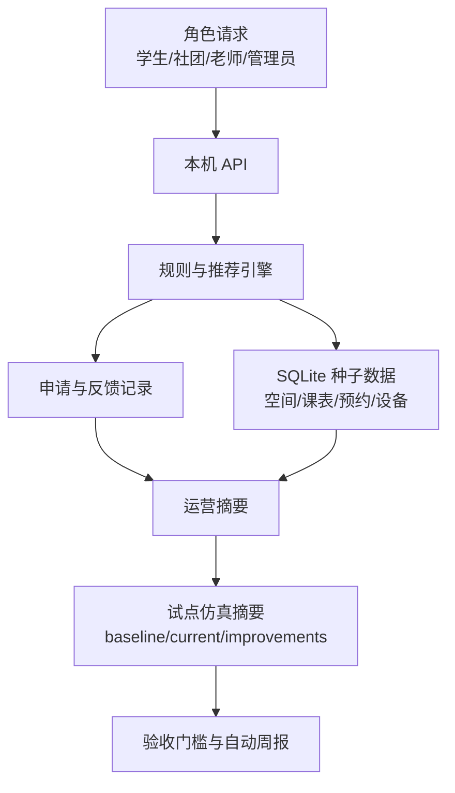

# CampusFlow V1.1 试点仿真数据说明

## 仿真目的

V1.1 的试点仿真数据用于回答评审中的一个关键问题：如果 CampusFlow 进入小范围试点，如何判断它真的改善了找空间和活动审批效率。

仿真不声称已经替代真实试点。它提供一个可复现的指标样本，用于演示验收口径、看板结构和 Go/No-Go 决策方式。

## 仿真范围

| 项目 | V1.1 仿真口径 |
| --- | --- |
| 周期 | 6 周 |
| 学生样本 | 96 人 |
| 社团样本 | 12 个 |
| 审批老师 | 6 人 |
| 空间样本 | 6 个高频空间 |
| 仿真请求 | 225 条角色与异常场景请求 |
| 数据源 | 空间表、课表、预约记录、设备状态、申请表、反馈日志、审计日志 |

## 样本场景

| 场景 | 角色 | 样本量 | 仿真结果 |
| --- | --- | ---: | --- |
| 普通学生找讨论室 | 学生 | 128 | 平均 2 次点击内找到可用空间，推荐采纳率 71% |
| 社团负责人提交活动 | 社团负责人 | 42 | 自动生成申请草稿、材料提醒和审批人建议 |
| 老师审批中风险活动 | 老师 | 31 | 审批队列集中展示风险项，平均处理周期缩短至 20 小时 |
| 管理员复盘高峰冲突 | 管理员 | 6 | 识别 TOP5 冲突空间并输出下周开放建议 |
| 异常与兜底处理 | 管理员 | 18 | 覆盖无可用空间、设备故障、权限不足和演示重置 |

## 基线与当前值

| 指标 | 试点前基线 | V1.1 仿真当前值 | 改善 |
| --- | ---: | ---: | ---: |
| 找空间平均耗时 | 18 分钟 | 9 分钟 | 降低 50% |
| 活动申请一次通过率 | 58% | 76% | 提升 18 个百分点 |
| 平均审批周期 | 36 小时 | 20 小时 | 缩短 44% |
| 高峰冲突率 | 22% | 14% | 下降 36% |
| 空间利用率 | 54% | 68% | 提升 14 个百分点 |
| 关键动作审计覆盖率 | 0% | 100% | 提升 100 个百分点 |

## 数据流

## 关键假设

| 假设 | 说明 |
| --- | --- |
| 基线来自人工流程 | 找空间和审批耗时以问卷、历史审批记录和访谈口径模拟 |
| 当前值来自 V1.1 流程 | 使用推荐、预审、审批队列和运营复盘后的预期结果 |
| 口径固定 | V1.1 API 返回确定性数据，便于评审复现 |
| 不接敏感数据 | 不使用个人轨迹、成绩、处分、心理等高风险数据 |
| 人工兜底保留 | 中高风险活动仍由老师或管理员审批 |

## 验收门槛

| 门槛 | 状态 | 证据 |
| --- | --- | --- |
| 找空间耗时降低 30%+ | PASS | 18 分钟降至 9 分钟，降低 50% |
| 一次通过率提升 15 个百分点+ | PASS | 58% 提升至 76%，提升 18 个百分点 |
| 审批周期缩短 30%+ | PASS | 36 小时降至 20 小时，缩短 44% |
| 高峰冲突率下降 25%+ | PASS | 22% 降至 14%，下降 36% |
| 关键动作审计覆盖 100% | PASS | 推荐、提交、审批、复盘、重置均写入审计日志 |
| 跨院系规则自动化覆盖 | WARN | 试点可控，但跨校区和临时借调规则建议进入 V1.2 |

## 结论口径

V1.1 自动验收结论为 `go`：6 项门槛通过 5 项，建议进入小范围真实试点。

推荐真实试点范围：

- 1 个学院。
- 2 个社团。
- 6 个高频空间。
- 2 周灰度使用。
- 每日查看 V1.1 看板并记录真实耗时、冲突率、退回原因。
