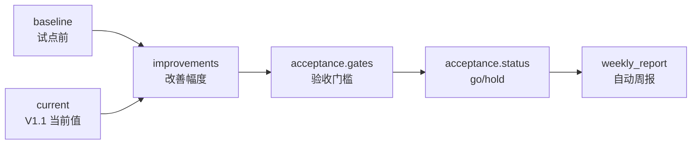

# CampusFlow V1.1 指标看板与自动验收摘要

## 看板目标

V1.1 管理员看板用于把试点结果从“口头描述”变成“一屏可检查”的评审证据。评委可以直接看到：

- 基线和当前值对比。
- 验收门槛 PASS/WARN。
- 角色场景覆盖量。
- 自动周报和下一步建议。
- 冲突空间与运营动作。

## 页面入口

启动本机服务后访问：

```text
http://127.0.0.1:8765
```

在左侧角色切换中选择“管理员”，中间结果区会显示 `V1.1 试点指标看板`。

## 后端接口

| API | 方法 | 用途 |
| --- | --- | --- |
| `/api/pilot/summary?role=管理员` | GET | 返回 V1.1 试点仿真、指标改善、验收门槛和周报 |
| `/api/operations/summary?role=管理员` | GET | 返回运营指标、冲突空间 TOP5、周报建议 |
| `/api/audit` | GET | 返回关键动作审计日志 |

## 自动验收摘要结构



核心 JSON 字段：

| 字段 | 说明 |
| --- | --- |
| `period` | 试点周期口径 |
| `sample` | 学生、社团、老师、空间和请求样本量 |
| `baseline` | 试点前基线指标 |
| `current` | V1.1 仿真当前指标 |
| `improvements` | 自动计算的改善率或百分点 |
| `acceptance` | Go/No-Go、通过数量、验收门槛 |
| `scenarios` | 覆盖的角色与异常场景 |
| `weekly_report` | 自动周报、进展、风险和下一步 |

## 看板模块

| 模块 | 展示内容 | 评审口径 |
| --- | --- | --- |
| 试点验收摘要 | 6 周仿真、通过 5/6 项、建议试点 | 是否达到进入真实试点条件 |
| 指标卡片 | 找空间耗时、一次通过率、审批周期、空间利用率 | 是否相比基线改善 |
| 验收门槛 | PASS/WARN 列表和证据 | 是否有可量化闸门 |
| 场景覆盖 | 各角色样本量 | 是否梳理主流程和异常 |
| 自动周报 | 有效进展、剩余风险、下一步 | 是否能支持试点复盘 |
| 冲突空间 | TOP5 冲突空间和原因 | 是否能形成运营动作 |

## 答辩讲解词

可以按 60 秒讲完：

> V1.1 新增了一个试点验收摘要接口，管理员页会同时读取运营摘要和试点摘要。这里的核心不是展示更多文字，而是把试点前基线、V1.1 当前值、改善幅度和验收门槛放在一屏里。当前 6 个验收门槛通过 5 个，自动结论是建议进入小范围真实试点；唯一 WARN 是跨院系、跨校区的复杂规则还需要真实试点继续沉淀，所以系统不会把它包装成已经完全生产化。

## 研发说明

V1.1 没有改变 V1.0 的主链路边界：

- 前端仍只通过 HTTP JSON API 通信。
- 后端试点摘要在服务层独立实现。
- SQLite schema 不新增生产复杂度。
- 关键动作继续写入审计日志。
- 中高风险审批仍由人工确认。

## 可核查点

| 核查方式 | 期望结果 |
| --- | --- |
| 打开管理员页面 | 看到 `V1.1 试点指标看板` 和 `试点验收摘要` |
| 请求 `/api/pilot/summary?role=管理员` | 返回 `acceptance.status = go` |
| 请求 `/api/audit` | 可看到 `pilot_summary` 审计动作 |
| 运行测试 | `test_pilot_review_summary_exposes_acceptance_gates_and_audit` 通过 |
