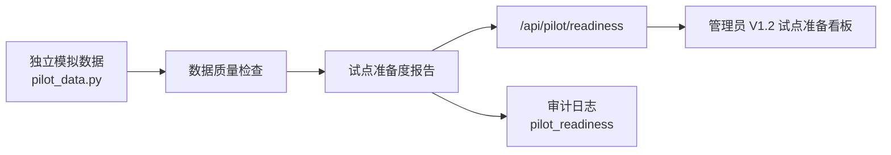

# CampusFlow V1.2 试点准备版总览

## 版本定位

CampusFlow V1.2 在 V1.1 评审版基础上，进一步补齐真实试点前最关键的准备能力：模拟数据导入、数据质量检查、试点配置摘要和准备度报告。

V1.2 的重点不是接入客户真实数据，而是用独立模拟数据证明产品具备试点前的数据治理能力。

## 核心升级

| 能力 | V1.1 | V1.2 |
| --- | --- | --- |
| 试点数据 | 6 周仿真指标 | 独立模拟导入数据包 |
| 隐私边界 | 说明不接敏感数据 | 自动检查禁止隐私字段 |
| 数据质量 | 展示指标结果 | 检查字段、冲突、容量、设备、权限 |
| 试点配置 | 建议进入小范围试点 | 输出学院、校区、周期、角色和成功门槛 |
| 自动报告 | 验收摘要 | 试点准备度报告 |

## 一句话介绍

V1.2 把 CampusFlow 从“可评审的试点仿真版”升级为“可与业务方和信息办讨论真实试点的数据准备版”。

## 新增接口

| API | 用途 |
| --- | --- |
| `GET /api/pilot/readiness?role=管理员` | 返回 V1.2 试点准备度、模拟数据状态、隐私边界和质量检查 |

返回重点字段：

| 字段 | 说明 |
| --- | --- |
| `version` | 固定为 `V1.2` |
| `privacy.data_mode` | 固定为 `independent_simulation` |
| `privacy.contains_customer_data` | 固定为 `false` |
| `datasets` | 模拟空间、课表、预约、设备和审批规则数量 |
| `quality_checks` | 数据质量检查结果 |
| `readiness_score` | 试点准备度评分 |
| `readiness_report.decision` | 是否建议进入受控真实试点准备 |

## V1.2 数据流

## 隐私原则

V1.2 开发阶段严格遵守：

- 不导入客户真实姓名。
- 不导入学号、工号、手机号、邮箱、证件号、地址。
- 不使用门禁轨迹、成绩、处分、心理等高风险数据。
- 模拟数据使用 `SIM-` 编码和虚构学院、虚构空间。
- 后续真实试点前，仍需由学校确认数据授权和只读同步方式。

## 当前交付状态

| 交付项 | 状态 | 文件 |
| --- | --- | --- |
| 模拟数据模块 | 已完成 | `apps/api/campusflow/pilot_data.py` |
| 准备度服务 | 已完成 | `apps/api/campusflow/service.py` |
| HTTP 接口 | 已完成 | `apps/api/campusflow/server.py` |
| 管理员页面 | 已完成 | `apps/web/app.js`, `apps/web/index.html`, `apps/web/styles.css` |
| 自动化测试 | 已完成 | `apps/api/tests/test_service.py`, `apps/api/tests/test_server.py` |
| V1.2 文档 | 已完成 | `deliverables/v1.2/` |

## 推荐答辩说法

> V1.2 没有接入客户真实数据，而是使用独立模拟数据构造了试点前的数据治理流程。系统会检查字段完整性、课表预约冲突、容量匹配、设备状态、权限范围和隐私字段，最后输出准备度评分。这样在真实试点前，我们可以先和业务方、信息办确认数据范围和质量口径，避免把客户隐私或不可用数据直接带入开发阶段。
