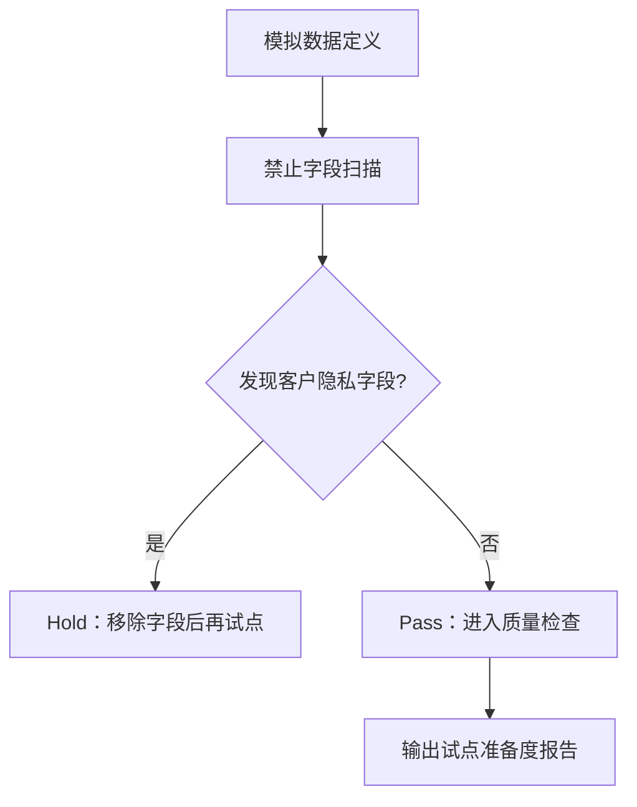

# CampusFlow V1.2 模拟数据与隐私边界说明

## 数据原则

V1.2 开发阶段只使用独立模拟数据，不导入客户真实数据。模拟数据用于验证导入结构、质量检查和试点准备报告，不用于替代真实业务数据。

## 模拟数据范围

| 数据集 | 内容 | 示例编码 |
| --- | --- | --- |
| 空间数据 | 虚构楼宇、空间、容量、设备、权限范围 | `SIM-SPACE-001` |
| 课表数据 | 虚构课程占用时间 | `SIM-SCH-001` |
| 预约数据 | 虚构预约时间、人数、活动类型 | `SIM-RES-001` |
| 设备状态 | 虚构设备巡检状态 | `SIM-EQ-001` |
| 审批规则 | 虚构人数、外校嘉宾、晚间活动规则 | `SIM-RULE-001` |
| 试点配置 | 虚构学院、校区、周期和角色 | 模拟信息学院 |

## 明确禁止字段

V1.2 模拟数据检查以下禁止字段：

| 字段 | 风险 |
| --- | --- |
| `name`, `real_name` | 真实姓名 |
| `student_id`, `employee_id` | 学号或工号 |
| `phone`, `mobile` | 手机号 |
| `email` | 邮箱 |
| `id_card`, `identity_number` | 证件号 |
| `address` | 个人地址 |

当前 V1.2 报告中：

```text
privacy.data_mode = independent_simulation
privacy.contains_customer_data = false
privacy.forbidden_fields_found = []
```

## 隐私边界流程



## 与真实试点的关系

V1.2 只证明系统具备数据治理能力。进入真实试点前，需要新增以下动作：

| 动作 | 负责人 |
| --- | --- |
| 明确数据授权范围 | 学校业务方、信息办 |
| 确认只读同步或脱敏导入方式 | 信息办、项目组 |
| 确认字段映射 | 数据负责人、项目组 |
| 复核是否包含个人敏感字段 | 信息办、法务或数据安全负责人 |
| 签署试点数据边界说明 | 业务负责人、项目负责人 |

## 推荐提交表述

> 为保护客户隐私，V1.2 开发阶段没有接入任何客户真实数据。所有导入数据均为独立模拟数据，系统通过禁止字段扫描确保不包含姓名、学号、手机号、邮箱、证件号等隐私字段。真实试点前，项目组会基于同一质量检查口径对学校授权数据进行只读或脱敏校验。
