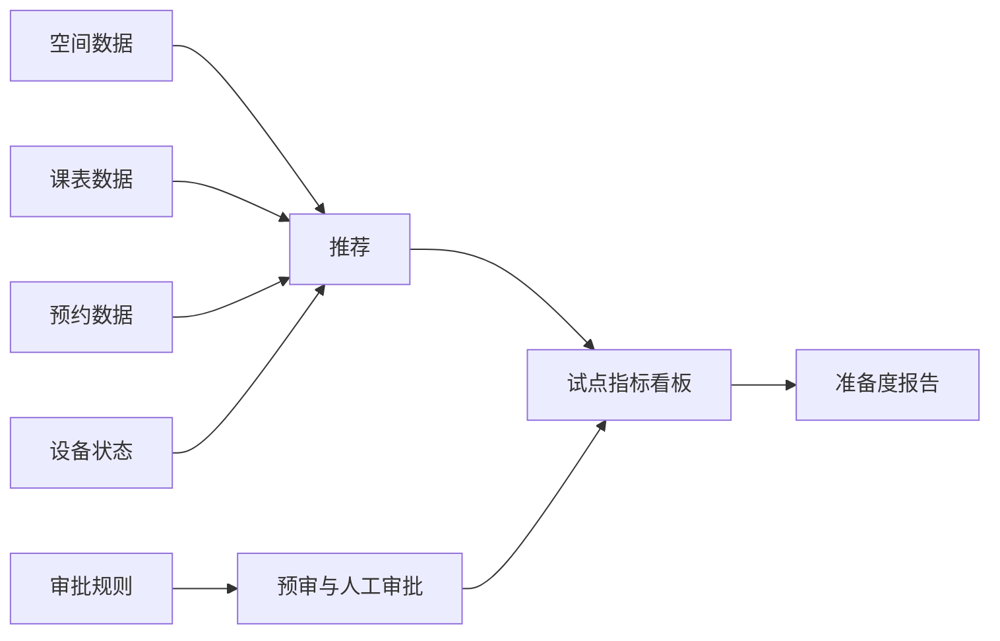

# CampusFlow V1.2 数据质量检查与试点配置说明

## 数据质量检查目标

V1.2 的质量检查用于回答真实试点前的三个问题：

1. 数据是否完整。
2. 数据是否可用于推荐、审批和复盘。
3. 数据是否符合隐私与权限边界。

## 检查项

| 检查项 | 结果口径 | 当前状态 |
| --- | --- | --- |
| 必填字段完整性 | 空间、课表、预约、设备、规则字段完整 | PASS |
| 客户隐私字段检查 | 不包含姓名、学号、手机号、邮箱、证件号等字段 | PASS |
| 课表与预约冲突检查 | 同一空间同一时间不重叠 | PASS |
| 容量匹配检查 | 预约人数不超过空间容量 | PASS |
| 设备状态检查 | 试点前需要复核的设备标为 WARN | WARN |
| 权限范围检查 | 所有空间限定在试点权限范围内 | PASS |

## 准备度评分

V1.2 使用确定性评分：

```text
准备度 = 通过检查项比例 * 100 - WARN 项扣分
```

当前模拟数据准备度：

```text
readiness_score = 80+
decision = ready_for_controlled_pilot
```

## 试点配置摘要

| 配置项 | 当前模拟值 |
| --- | --- |
| 组织范围 | 模拟信息学院 |
| 校区范围 | 模拟东校区 |
| 试点周期 | 2 周受控真实试点准备 |
| 空间范围 | 8 个模拟高频空间 |
| 参与角色 | 学生、社团负责人、老师、管理员 |
| 成功门槛 | 数据质量、隐私边界、角色范围、验收指标可说明 |

## 质量检查与产品链路关系



## 当前风险

| 风险 | 说明 | 处理 |
| --- | --- | --- |
| 设备状态 WARN | 模拟活动室 301 的麦克风需要复核 | 真实试点前做设备巡检 |
| 真实数据授权未完成 | V1.2 暂不接真实客户数据 | 试点前确认只读或脱敏同步 |
| 规则口径可能变化 | 不同学院审批规则可能不同 | V1.3 可做规则配置中心 |

## 下一步建议

1. 与业务方确认试点学院、空间范围和周期。
2. 与信息办确认只读数据同步或脱敏导入方式。
3. 使用 V1.2 质量检查口径校验授权数据。
4. 将准备度报告作为真实试点 Go/No-Go 前置材料。
