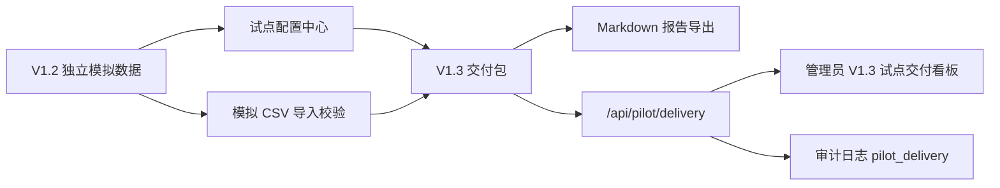

# CampusFlow V1.3 试点交付版总览

## 版本定位

CampusFlow V1.3 在 V1.2 试点准备版基础上，补齐试点提交前的三个交付能力：试点配置中心、模拟导入校验和自动 Markdown 报告导出。

V1.3 的目标不是扩大功能范围，而是把现有 MVP、V1.1 指标看板和 V1.2 数据准备能力整理成一套可提交、可答辩、可进入受控试点评审的交付包。

## 核心升级

| 能力 | V1.2 | V1.3 |
| --- | --- | --- |
| 试点配置 | 输出配置摘要 | 输出可评审的配置中心与配置编号 |
| 模拟导入 | 检查独立模拟数据 | 展示模拟 CSV 批次、校验结果和警告项 |
| 隐私边界 | 禁止字段扫描 | 在交付报告中固化隐私结论 |
| 自动报告 | 准备度报告 | Markdown 试点交付报告 |
| 交付状态 | `ready_for_controlled_pilot` | `ready_to_submit` |

## 一句话介绍

V1.3 把 CampusFlow 从“可进入试点准备”升级为“可以提交给业务负责人、信息办和评审老师审阅的试点交付版”。

## 新增接口

| API | 用途 |
| --- | --- |
| `GET /api/pilot/delivery?role=管理员` | 返回 V1.3 试点配置、模拟导入校验、Markdown 报告和交付状态 |

返回重点字段：

| 字段 | 说明 |
| --- | --- |
| `version` | 固定为 `V1.3` |
| `config_center.status` | 固定为 `configured` |
| `config_center.config_id` | 当前配置编号，示例为 `CFG-V13-SIM-001` |
| `simulated_import.source` | 固定为 `independent_simulated_csv` |
| `simulated_import.validation.status` | 模拟导入校验结论 |
| `simulated_import.privacy.contains_customer_data` | 固定为 `false` |
| `report_export.format` | 固定为 `markdown` |
| `report_export.markdown` | 自动生成的试点交付报告正文 |
| `delivery_status` | 固定为 `ready_to_submit` |

## V1.3 交付链路

## 隐私原则

V1.3 延续 V1.2 的开发边界：

- 仅使用独立模拟数据，不导入客户真实数据。
- 不使用真实姓名、学号、工号、手机号、邮箱、证件号、地址。
- 不使用门禁轨迹、成绩、处分、心理等高风险数据。
- 模拟导入批次使用 `SIM-` 编码和虚构学院、虚构空间。
- 真实试点前仍需学校确认数据授权、只读同步或脱敏导入方式。

## 当前交付状态

| 交付项 | 状态 | 文件 |
| --- | --- | --- |
| 试点配置中心数据 | 已完成 | `apps/api/campusflow/pilot_data.py` |
| 模拟导入校验 | 已完成 | `apps/api/campusflow/pilot_data.py` |
| Markdown 报告导出 | 已完成 | `apps/api/campusflow/pilot_data.py` |
| 交付服务与审计 | 已完成 | `apps/api/campusflow/service.py` |
| HTTP 接口 | 已完成 | `apps/api/campusflow/server.py` |
| 管理员页面 | 已完成 | `apps/web/app.js`, `apps/web/index.html`, `apps/web/styles.css` |
| 自动化测试 | 已完成 | `apps/api/tests/test_service.py`, `apps/api/tests/test_server.py` |
| V1.3 文档 | 已完成 | `deliverables/v1.3/` |

## 推荐答辩说法

> V1.3 不是简单增加页面，而是把试点前最容易被追问的三个问题固化成系统能力：试点范围怎么配、模拟数据是否能导入并校验、提交材料能否自动生成。为了保护客户隐私，开发阶段仍然只使用独立模拟数据，系统返回的隐私结论为 `contains_customer_data = false`，并且自动报告会把这个边界写入交付材料。
