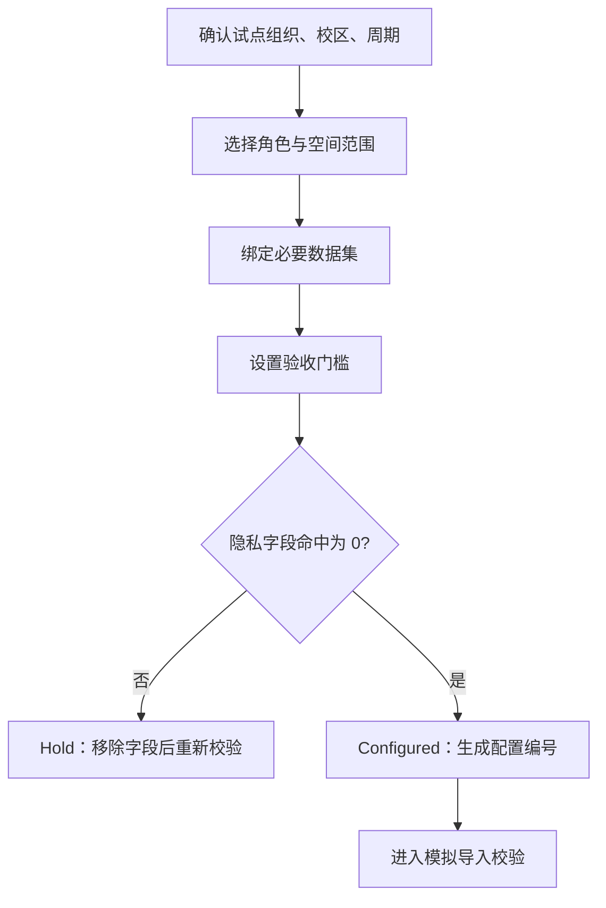

# CampusFlow V1.3 试点配置中心说明

## 配置中心目标

试点配置中心用于把“试点怎么做”从口头说明变成可评审、可追踪、可冻结的系统配置。V1.3 当前采用确定性配置包，便于答辩演示、试点前评审和后续扩展为真实后台配置。

## 当前配置

| 配置项 | 当前模拟值 |
| --- | --- |
| 配置状态 | `configured` |
| 配置编号 | `CFG-V13-SIM-001` |
| 组织范围 | 模拟信息学院 |
| 校区范围 | 模拟东校区 |
| 试点周期 | 2 周受控真实试点准备 |
| 空间范围 | 8 个模拟高频空间 |
| 权限范围 | `pilot_east` |
| 参与角色 | 学生、社团负责人、老师、管理员 |

## 验收门槛

| 门槛 | 当前值 | 用途 |
| --- | --- | --- |
| `readiness_score_min` | 80 | 准备度评分不低于 80 |
| `required_dataset_status` | `ready_or_warning` | 允许设备类 WARN 进入人工复核 |
| `privacy_forbidden_fields_max` | 0 | 禁止隐私字段命中数必须为 0 |
| `report_sections_min` | 5 | 自动报告章节不少于 5 个 |

## 必要数据集

| 数据集 | 当前来源 | 说明 |
| --- | --- | --- |
| `spaces` | 独立模拟 CSV | 空间容量、类型、设备、权限范围 |
| `schedules` | 独立模拟 CSV | 课程和固定占用 |
| `reservations` | 独立模拟 CSV | 已有预约和活动占用 |
| `equipment_status` | 独立模拟 CSV | 设备巡检状态 |
| `approval_rules` | 独立模拟 CSV | 审批规则和人工复核条件 |

## 配置中心流程

## 与 V2.0 的关系

V1.3 配置中心是 V2.0 配置后台的雏形。后续可继续扩展：

| V1.3 | V2.0 可扩展方向 |
| --- | --- |
| 固定模拟配置 | 后台可编辑配置表 |
| 单一试点范围 | 多学院、多校区、多周期配置 |
| 确定性验收门槛 | 按学校策略调整门槛 |
| API 返回配置包 | 配置版本冻结、回滚和审批流 |

## 提交说明

> 当前 V1.3 配置中心已经能够展示试点组织、校区、周期、角色、空间范围和验收门槛。由于仍处于开发与评审阶段，配置绑定的是独立模拟数据，不涉及客户真实数据。真实试点前，可以在该配置口径上替换为学校授权的只读或脱敏数据。
