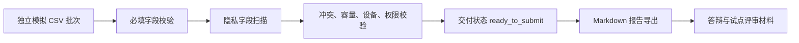

# CampusFlow V1.3 模拟导入校验与报告导出说明

## 目标

V1.3 用独立模拟 CSV 批次验证导入、校验、报告导出的完整链路。该能力用于说明 CampusFlow 已具备试点交付前的数据治理闭环，但开发阶段不导入客户真实数据。

## 模拟导入批次

| 批次文件 | 数据集 | 行数 | 当前状态 |
| --- | --- | --- | --- |
| `spaces_simulated.csv` | `spaces` | 8 | `validated` |
| `schedules_simulated.csv` | `schedules` | 3 | `validated` |
| `reservations_simulated.csv` | `reservations` | 3 | `validated` |
| `equipment_simulated.csv` | `equipment_status` | 3 | `validated_with_warning` |
| `approval_rules_simulated.csv` | `approval_rules` | 4 | `validated` |

## 校验结果

| 校验项 | 当前状态 | 说明 |
| --- | --- | --- |
| 必填字段完整性 | PASS | 模拟导入数据必填字段完整 |
| 客户隐私字段检查 | PASS | 未发现姓名、学号、手机号、邮箱、证件号等字段 |
| 课表与预约冲突检查 | PASS | 模拟课表和预约未发现时间重叠 |
| 容量匹配检查 | PASS | 模拟预约人数未超过空间容量 |
| 设备状态检查 | WARN | 模拟活动室 301 的麦克风需试点前复核 |
| 权限范围检查 | PASS | 所有模拟空间均限定在试点权限范围内 |

当前结论：

```text
simulated_import.source = independent_simulated_csv
simulated_import.validation.status = pass
simulated_import.validation.passed = 5
simulated_import.validation.warnings = 1
simulated_import.validation.failed = 0
privacy.contains_customer_data = false
privacy.forbidden_fields_found = []
```

## 报告导出

V1.3 的 `/api/pilot/delivery?role=管理员` 会自动返回 Markdown 报告内容。

| 字段 | 当前值 |
| --- | --- |
| `report_export.format` | `markdown` |
| `report_export.filename` | `campusflow-v1.3-pilot-delivery-report.md` |
| `report_export.sections` | 版本结论、试点配置、模拟导入校验、隐私边界、质量检查、下一步动作 |

报告标题：

```text
# CampusFlow V1.3 试点交付报告
```

## 导入到报告链路



## 边界与异常处理

| 情况 | 处理口径 |
| --- | --- |
| 命中客户隐私字段 | 交付状态应进入 Hold，移除字段后重新校验 |
| 必填字段缺失 | 导入校验失败，不能进入报告提交 |
| 课表与预约冲突 | 进入人工复核或调整空间推荐口径 |
| 容量超限 | 阻断导入或改派更大空间 |
| 设备 WARN | 可进入试点前复核清单，不直接阻断交付 |
| 权限范围不明 | 阻断真实试点，需业务方确认授权范围 |

## 推荐答辩说法

> V1.3 的导入校验不是为了证明模拟数据本身真实，而是证明系统已经具备处理试点数据的流程：批次进入、字段检查、隐私扫描、业务校验、警告项复核、最后自动生成 Markdown 交付报告。开发阶段所有批次都是独立模拟数据，确保不会触碰客户隐私。
