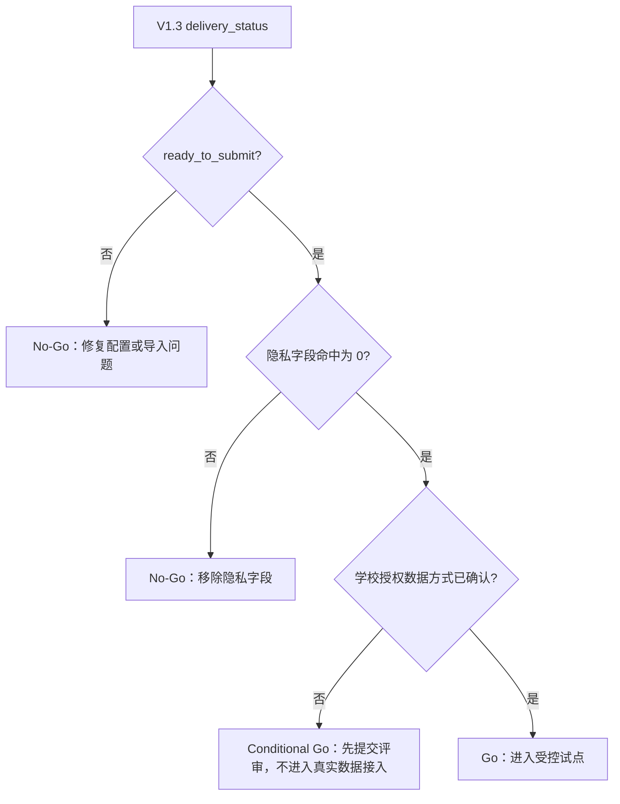

# CampusFlow V1.3 验收清单

## 功能验收

| 项目 | 通过标准 |
| --- | --- |
| 试点配置中心 | `/api/pilot/delivery` 返回 `config_center.status = configured` |
| 配置编号 | 返回 `config_center.config_id = CFG-V13-SIM-001` |
| 模拟导入校验 | 返回 `simulated_import.source = independent_simulated_csv` |
| 隐私检查 | 返回 `contains_customer_data = false` 且 `forbidden_fields_found = []` |
| 校验结论 | 返回 `simulated_import.validation.status = pass` |
| 自动报告导出 | 返回 `report_export.format = markdown` 和 Markdown 正文 |
| 管理员页面 | 显示 `CampusFlow V1.3 试点交付版` 与 `V1.3 试点交付看板` |
| 审计日志 | 调用 delivery 接口会写入 `pilot_delivery` |
| 文档包 | `deliverables/v1.3/` 四份文档齐全 |

## API 验收

```bash
curl "http://127.0.0.1:8765/api/pilot/delivery?role=%E7%AE%A1%E7%90%86%E5%91%98"
```

关键字段：

| 字段 | 期望 |
| --- | --- |
| `version` | `V1.3` |
| `config_center.status` | `configured` |
| `simulated_import.privacy.data_mode` | `independent_simulation` |
| `simulated_import.privacy.contains_customer_data` | `false` |
| `simulated_import.validation.status` | `pass` |
| `report_export.format` | `markdown` |
| `report_export.markdown` | 包含 `CampusFlow V1.3 试点交付报告` |
| `delivery_status` | `ready_to_submit` |

## 自动化测试

运行：

```bash
PYTHONPATH=apps/api python -m unittest discover -s apps/api/tests -v
```

重点测试：

| 测试 | 覆盖 |
| --- | --- |
| `test_pilot_delivery_exports_configured_simulated_report` | V1.3 配置中心、模拟导入校验、报告导出和审计 |
| `test_main_api_chain_supports_local_mvp` | 主链路、V1.1 摘要、V1.2 readiness、V1.3 delivery API |
| `test_static_frontend_assets_are_served` | V1.3 页面文案、前端钩子和 delivery API 引用 |

## 提交前人工核查

| 核查点 | 结果 |
| --- | --- |
| 页面顶部显示 `CampusFlow V1.3 试点交付版` | 待确认 |
| 管理员视图显示试点配置中心 | 待确认 |
| 管理员视图显示模拟导入批次和校验状态 | 待确认 |
| 管理员视图显示 Markdown 报告预览 | 待确认 |
| `/api/pilot/delivery` live 接口返回 `ready_to_submit` | 待确认 |
| `/api/pilot/readiness` 仍保持 V1.2 隐私边界 | 待确认 |

## 试点前 Go/No-Go 判断



## 当前结论

V1.3 当前结论为：

```text
delivery_status = ready_to_submit
```

含义：CampusFlow 已具备提交和评审所需的试点配置、模拟导入校验和自动报告导出能力。真实试点前仍需学校确认数据授权、只读同步或脱敏导入方式。
