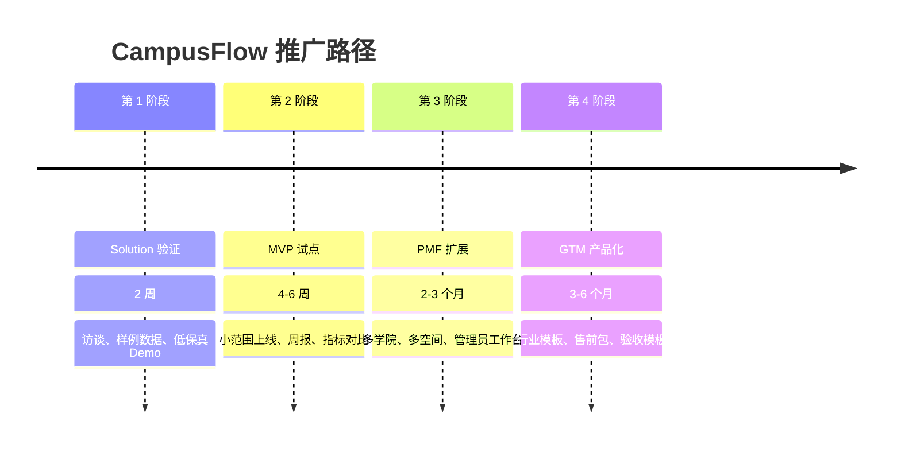
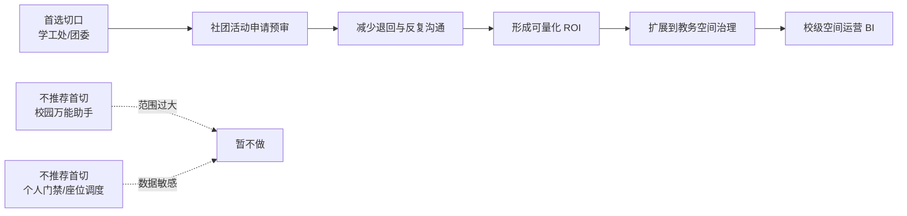
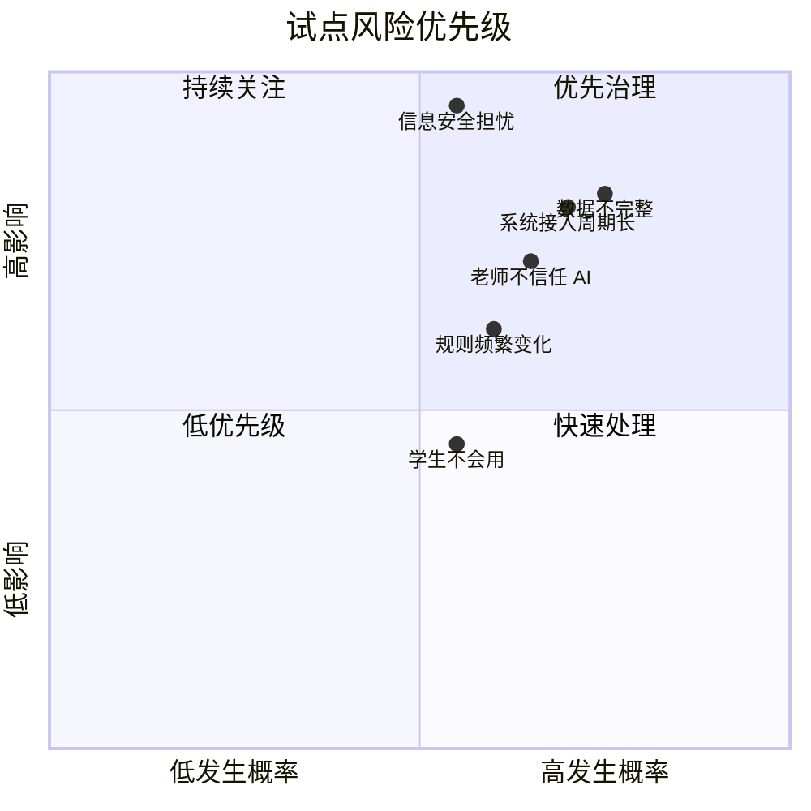

# 运营推广方案

## 一、运营目标

CampusFlow 的运营目标不是短期获得大量学生访问，而是在一个可控试点范围内证明三件事：

1. 学生和社团愿意用自然语言找空间、发起申请。
2. 老师和管理员认可 AI 预审能减少重复核对。
3. 学校管理方能看到效率提升和空间利用改善。

因此推广策略采用 “Solution 验证 → MVP 试点 → PMF 扩展 → GTM 产品化” 四阶段推进。

## 二、试点学校选择

优先选择具备以下特征的高校或学院：

| 选择标准 | 理想状态 | 原因 |
| --- | --- | --- |
| 场地需求 | 社团活跃、晚间自习需求高 | 高频场景更容易验证价值 |
| 管理意愿 | 学工/团委或教务愿意共创 | 有业务负责人才能推动试点 |
| 数据条件 | 能导出课表、空间表、预约表 | MVP 不必立即做复杂接口 |
| 审批链路 | 社团活动审批较规范 | 规则明确，适合 AI 预审 |
| IT 支持 | 信息办能提供权限和数据建议 | 降低合规和接入风险 |
| 试点范围 | 一个学院、一组楼宇或一个活动中心 | 控制复杂度，便于复盘 |

不建议一开始全校铺开。全校项目会引入过多部门、系统和规则，导致验证周期变长。

## 三、四阶段推进路径

### 阶段 1：Solution 验证

周期：2 周

目标：验证方案是否值得做，而不是立即开发完整系统。

动作：

1. 访谈 5-8 位学生/社团负责人，确认找空间和借场地频率。
2. 访谈 2-3 位辅导员或场地管理员，确认审批核对痛点。
3. 收集一份空间清单、一份课表样例、一份活动申请表样例。
4. 用 Mock 数据做低保真 Demo 或流程图。
5. 让业务方评估推荐理由和申请预审是否可信。

验收指标：

| 指标 | 目标 |
| --- | --- |
| 访谈对象认为场景高频 | ≥ 70% |
| 老师认为 AI 预审有帮助 | ≥ 70% |
| 能拿到 Demo 所需三类数据样例 | 空间、课表、申请表 |
| 明确一个试点负责人 | 至少 1 位 |

### 阶段 2：MVP 试点

周期：4-6 周

目标：在小范围内跑通真实业务闭环。

试点范围建议：

1. 1 个学院。
2. 1-2 栋教学楼。
3. 1 个学生活动中心或报告厅。
4. 20-50 个空间。
5. 10-20 个社团负责人。
6. 3-5 位审批老师或管理员。

核心动作：

1. 导入空间基础信息、课表、预约记录和审批规则。
2. 上线学生/社团自然语言找空间入口。
3. 上线社团活动申请单生成和风险预审。
4. 审批老师使用工作台查看 AI 预审结果。
5. 每周输出一次试点运营周报。
6. 记录推荐采纳、申请退回、审批时长和用户反馈。

MVP 验收指标：

| 指标 | 目标 |
| --- | --- |
| 场地推荐人工抽检通过率 | ≥ 90% |
| 申请单字段完整率 | ≥ 85% |
| 风险识别命中率 | ≥ 80% |
| 社团申请一次通过率 | 提升 30% |
| 管理员人工核对时间 | 降低 40% |
| 推荐采纳率 | ≥ 60% |
| 用户点踩率 | ≤ 10% |

详细验收口径、基线采集方式、数据分类与安全边界见 `06_试点实施与验收方案.md`。MVP 试点不只看功能是否上线，还要看试点前后指标是否可对比、推荐和风险预审是否可抽检、人工审批和审计日志是否完整。

### 阶段 3：PMF 扩展

周期：2-3 个月

目标：验证产品能否从一个点扩展到更大范围，并保持稳定复用。

扩展方向：

1. 从一个学院扩展到多个学院。
2. 从活动场地扩展到普通教室、自习空间和研讨室。
3. 接入后勤设备状态，过滤设备不可用空间。
4. 上线管理员冲突调度工作台。
5. 上线空间利用率、冲突率和审批效率 BI 看板。
6. 建立规则维护机制，让业务方能更新审批规则。

PMF 观察指标：

| 指标 | 目标 |
| --- | --- |
| 月活跃社团覆盖率 | ≥ 50% |
| 重复使用率 | ≥ 40% |
| 审批老师持续使用率 | ≥ 60% |
| 试点范围外部门主动咨询 | ≥ 2 个 |
| 周报被管理者阅读或转发 | 连续 4 周发生 |

### 阶段 4：GTM 产品化

周期：3-6 个月

目标：沉淀为可复制的高校行业解决方案。

产品化资产：

1. 高校空间数据模型模板。
2. 社团活动审批规则模板。
3. 空间利用率 BI 看板模板。
4. 运营周报模板。
5. Demo 数据包。
6. 售前演示脚本。
7. 试点验收报告模板。
8. 数据安全和权限配置清单。
9. 试点验收方案模板。

销售叙事：

> CampusFlow 帮高校降低场地申请和空间调度的人力成本，用 AI 预审减少反复沟通，用数据看板提升空间资源利用率，并保留人工审批和审计机制，适合从学工/团委场地审批或教务空间治理切入。

## 四、冷启动策略

### 4.1 学生和社团端

| 动作 | 目的 | 执行方式 |
| --- | --- | --- |
| 社团负责人培训 | 让高频申请者先用起来 | 在社团例会或培训会演示 |
| 二维码入口 | 降低使用门槛 | 张贴在教学楼、活动中心、图书馆 |
| 示例问题引导 | 降低自然语言输入成本 | 提供“今晚找 4 人讨论室”等示例 |
| 申请材料自动清单 | 形成直接价值 | 让社团看到少打回的收益 |
| 反馈激励 | 收集推荐质量 | 点赞/点踩后提示系统会优化推荐 |

### 4.2 老师和管理员端

| 动作 | 目的 | 执行方式 |
| --- | --- | --- |
| 共创规则表 | 提升信任 | 和老师一起确认审批规则 |
| 人工审批保留 | 降低抵触 | 明确 AI 只预审，不替代老师 |
| 每周复盘会 | 快速修正问题 | 看退回原因、误判案例和数据缺口 |
| 工作台默认展示风险摘要 | 节省核对时间 | 把风险项、数据来源放在审批页顶部 |
| 管理员白名单 | 控制试点风险 | 先开放给少数老师和管理员 |

### 4.3 管理者端

| 动作 | 目的 | 执行方式 |
| --- | --- | --- |
| 试点周报 | 持续证明价值 | 每周展示效率、冲突和利用率变化 |
| 阶段验收会 | 争取扩展资源 | 用指标说明节省时间和满意度 |
| 对比试点前后 | 形成 ROI | 比较审批时长、退回率、冲突率 |
| 提供扩展路线 | 推动采购 | 从学院试点到全校空间治理 |

## 五、采购切口设计

### 推荐切口：学工处/团委的社团活动场地审批

理由：

1. 社团活动申请频率高，痛点明显。
2. 规则相对可整理，适合 AI 预审。
3. 涉及角色有限，试点阻力小于全校教务系统改造。
4. 指标容易量化：申请一次通过率、审批时长、退回次数。
5. 成功后可以扩展到教务空间治理和校级 BI。

### 备选切口：教务处教室利用率治理

适用场景：

1. 晚间自习空间紧张。
2. 课程和活动场地冲突频繁。
3. 学校已有较完整课表和预约数据。
4. 教务处关注空间利用率和资源优化。

### 不推荐作为首个切口

| 切口 | 原因 |
| --- | --- |
| 校园全能 AI 助手 | 范围过大，ROI 不清 |
| 门禁/座位实时调度 | 数据敏感，接入复杂 |
| 后勤维修优化 | 价值存在，但不如场地审批高频 |
| 校级数据治理平台 | 周期长，容易变成大型集成项目 |

## 六、运营指标看板

### 6.1 用户使用指标

| 指标 | 含义 | 使用场景 |
| --- | --- | --- |
| 查询次数 | 用户使用自然语言找空间次数 | 判断需求强度 |
| 推荐采纳率 | 点击预约或提交申请的比例 | 判断推荐质量 |
| 点踩率 | 用户认为推荐不合适的比例 | 发现规则问题 |
| 复用率 | 同一用户再次使用比例 | 判断是否形成习惯 |

### 6.2 审批效率指标

| 指标 | 含义 | 使用场景 |
| --- | --- | --- |
| 申请一次通过率 | 首次提交即通过比例 | 衡量材料完整度 |
| 平均审批时长 | 从提交到审批完成的时间 | 衡量流程效率 |
| 退回原因 TOP5 | 最常见的退回原因 | 优化提示和规则 |
| 高风险申请占比 | 中高风险活动比例 | 判断人工审核压力 |

### 6.3 空间运营指标

| 指标 | 含义 | 使用场景 |
| --- | --- | --- |
| 空间利用率 | 已使用时长 / 可开放时长 | 发现空置和拥堵 |
| 热门时段冲突率 | 冲突申请 / 总申请 | 判断供需矛盾 |
| 空置空间排行 | 长期低利用空间 | 优化开放策略 |
| 设备故障影响次数 | 故障导致取消或调换的次数 | 指导维修优先级 |

## 七、风险控制

| 风险 | 表现 | 应对 |
| --- | --- | --- |
| 数据不完整 | 推荐空间实际不可用 | 展示数据更新时间，允许管理员快速标记不可用 |
| 老师不信任 AI | 不愿看预审结果 | 先用 AI 做摘要和材料检查，不做自动批准 |
| 规则频繁变化 | 审批要求不稳定 | 建立规则表和版本记录 |
| 信息安全担忧 | 担心越权查数据 | 角色权限、最小化数据、审计日志 |
| 学生不会用 | 不知道如何提问 | 提供示例问题和快捷筛选 |
| 试点指标不明显 | 管理方看不到价值 | 聚焦审批打回率和人工核对时间这两个硬指标 |
| 系统接入周期长 | 无法快速上线 | Demo 用 Mock，试点用 CSV，正式版再 API |

## 八、试点复盘模板

每周复盘建议包含：

1. 本周查询次数、申请次数、推荐采纳率。
2. 申请一次通过率和平均审批时长。
3. 被退回最多的 5 类原因。
4. 推荐错误或用户点踩案例。
5. 热门时段和冲突最多的空间。
6. 需要业务方确认的新规则。
7. 下周优化动作。

## 九、运营结论

CampusFlow 的推广不应从“大而全的智慧校园平台”讲起，而应从一个具体部门的具体效率问题切入。最优路径是先帮助学工/团委减少社团场地申请的反复沟通，再通过数据沉淀证明空间治理价值，最后扩展到教务、后勤和校级管理看板。
