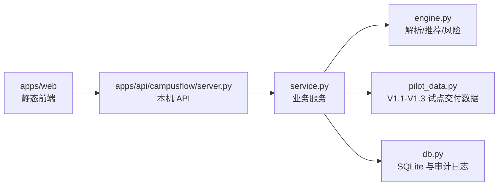

# CampusFlow 初步实现与 Demo 运行说明

## 实现范围

当前初步实现以本电脑作为后端，提供本地 JSON API、静态前端页面和 SQLite 审计日志。提交包中的干净源码快照位于：

```text
10_初步实现源码/
```

源码快照只包含必要源文件，不包含本地数据库、运行日志和缓存文件。

## 技术结构



## 运行方式

进入 `10_初步实现源码/` 目录后运行：

```bash
PYTHONPATH=apps/api python -m campusflow.server
```

打开：

```text
http://127.0.0.1:8765
```

## 测试方式

进入 `10_初步实现源码/` 目录后运行：

```bash
PYTHONPATH=apps/api python -m unittest discover -s apps/api/tests -v
```

当前主项目验证结果为：

```text
Ran 13 tests
OK
```

## 主要 API

| API | 用途 |
| --- | --- |
| `GET /api/health` | 健康检查 |
| `GET /api/roles` | 获取演示角色 |
| `POST /api/intent/parse` | 自然语言意图解析 |
| `POST /api/spaces/recommend` | 空间推荐 |
| `POST /api/applications/draft` | 生成活动申请草稿 |
| `POST /api/applications/submit` | 提交申请 |
| `GET /api/applications?role=老师` | 老师查看待审批申请 |
| `POST /api/reviews/{application_id}/decision` | 审批通过、退回、调场或拒绝 |
| `GET /api/operations/summary?role=管理员` | 管理员运营看板 |
| `GET /api/pilot/summary?role=管理员` | V1.1 试点仿真摘要 |
| `GET /api/pilot/readiness?role=管理员` | V1.2 试点准备度报告 |
| `GET /api/pilot/delivery?role=管理员` | V1.3 试点交付报告 |
| `POST /api/demo/reset` | 重置演示数据 |

## 页面能力

| 角色 | 页面能力 |
| --- | --- |
| 学生 | 一句话找空间、查看推荐理由、采纳或反馈 |
| 社团负责人 | 生成活动申请草稿、查看风险项、提交审批 |
| 老师 | 查看申请队列、执行审批动作 |
| 管理员 | 查看运营看板、V1.3 试点交付状态、模拟导入校验和报告预览 |

## 数据边界

当前 Demo 使用种子校园数据和独立模拟试点数据。开发阶段不导入客户真实姓名、学号、工号、手机号、邮箱、证件号、地址、门禁轨迹、成绩、处分、心理等敏感数据。

V1.3 delivery 接口预期返回：

```text
version = V1.3
config_center.status = configured
simulated_import.source = independent_simulated_csv
simulated_import.privacy.contains_customer_data = false
simulated_import.validation.status = pass
report_export.format = markdown
delivery_status = ready_to_submit
```
