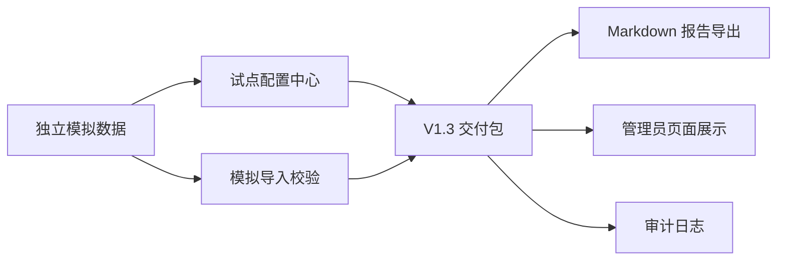

# CampusFlow V1.3 试点交付说明

## 版本定位

CampusFlow V1.3 在 V1.2 试点准备版基础上，补齐提交和试点评审前需要展示的三项能力：

1. 试点配置中心。
2. 模拟导入校验。
3. 自动 Markdown 报告导出。

V1.3 的目标是把产品方案、试点数据准备、管理员看板和本机 Demo 整理成可评审、可试点、可继续迭代的交付版本。

## 核心能力

| 能力 | 当前实现 |
| --- | --- |
| 试点配置中心 | 返回配置状态、配置编号、组织范围、校区范围、角色范围、空间范围和验收门槛 |
| 模拟导入校验 | 以独立模拟 CSV 批次验证空间、课表、预约、设备和审批规则数据 |
| 隐私边界检查 | 扫描姓名、学号、工号、手机号、邮箱、证件号、地址等禁止字段 |
| 质量检查 | 检查必填字段、冲突、容量、设备状态和权限范围 |
| 报告导出 | 自动返回 Markdown 交付报告正文和章节列表 |
| 交付状态 | 返回 `ready_to_submit` |

## V1.3 API

```bash
curl "http://127.0.0.1:8765/api/pilot/delivery?role=%E7%AE%A1%E7%90%86%E5%91%98"
```

关键返回字段：

| 字段 | 期望 |
| --- | --- |
| `version` | `V1.3` |
| `config_center.status` | `configured` |
| `config_center.config_id` | `CFG-V13-SIM-001` |
| `simulated_import.source` | `independent_simulated_csv` |
| `simulated_import.validation.status` | `pass` |
| `simulated_import.privacy.data_mode` | `independent_simulation` |
| `simulated_import.privacy.contains_customer_data` | `false` |
| `simulated_import.privacy.forbidden_fields_found` | `[]` |
| `report_export.format` | `markdown` |
| `delivery_status` | `ready_to_submit` |

## 交付链路



## 隐私与数据边界

V1.3 开发阶段只使用独立模拟数据，不导入客户真实数据。

明确不使用：

- 真实姓名。
- 学号、工号。
- 手机号、邮箱。
- 证件号、地址。
- 门禁轨迹、成绩、处分、心理等高风险数据。

真实试点前需要由学校确认数据授权、只读同步或脱敏导入方式。

## 验收结论

当前 V1.3 结论为：

```text
delivery_status = ready_to_submit
```

含义：CampusFlow 已具备提交和试点评审所需的配置中心、模拟导入校验和自动报告导出能力。进入真实试点前仍需完成学校授权数据范围确认、角色白名单确认和人工兜底流程确认。
